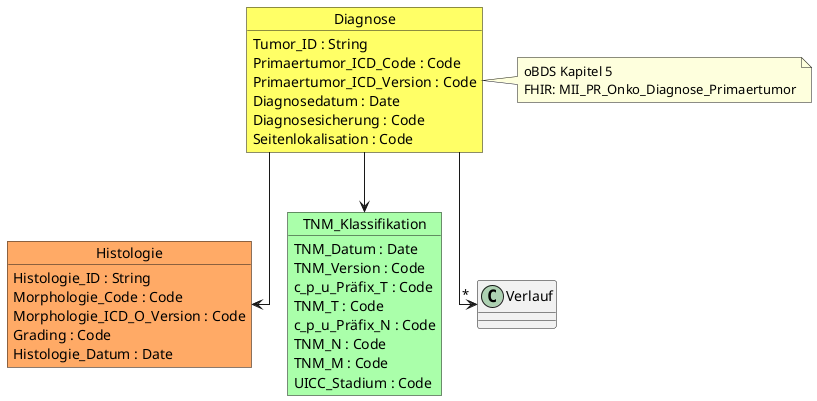

# PlantUML Diagram Style Guide for MII Onkologie

This skill provides guidance for creating and maintaining PlantUML diagrams that represent the oBDS logical model.

## When to Use This Skill

Use this skill when:
- Creating new logical model diagrams
- Updating existing diagrams with new oBDS elements
- Ensuring diagram-to-profile consistency
- Documenting relationships between profiles

---

## Diagram Location

PlantUML source files are located in `input/images-source/`:

| File | Purpose |
|------|---------|
| `onco_merged.puml` | Complete oBDS model |
| `uml_fhir_diagnosis.puml` | Diagnosis-related elements |
| `uml_fhir_therapy.puml` | Therapy-related elements |

---

## Color Coding Convention

Use consistent colors to group related concepts:

```plantuml
' Diagnosis & Tumor
object Diagnose #FFFF66 {}           ' Yellow - Diagnosis
object Frühere_Tumorerkrankung #FFFF66 {}

' Histology & Pathology
object Histologie #FFAA66 {}         ' Orange - Histology/Pathology
object Grading #FFAA66 {}

' Status & Assessment
object Allgemeiner_Leistungszustand #22FF22 {}  ' Green - Status/Assessment
object Verlauf #22FF22 {}

' Therapy & Procedures
object OP #9999FF {}                 ' Blue - Therapy/Procedures
object Strahlentherapie #9999FF {}
object Systemische_Therapie #9999FF {}

' Adverse Events
object Nebenwirkungen #FF9999 {}     ' Light red - Adverse events

' Care Planning
object Tumorkonferenz #CCCCFF {}     ' Light blue - Care planning

' TNM Classification
object TNM_Klassifikation #AAFFAA {} ' Light green - TNM
```

### Color Reference Table

| Color Code | Category | Examples |
|------------|----------|----------|
| `#FFFF66` | Diagnosis | Diagnose, Frühere Tumorerkrankung |
| `#FFAA66` | Histology/Pathology | Histologie, Grading |
| `#22FF22` | Status/Assessment | ECOG, Verlauf |
| `#9999FF` | Therapy/Procedures | OP, Strahlentherapie, Systemische Therapie |
| `#FF9999` | Adverse Events | Nebenwirkungen |
| `#CCCCFF` | Care Planning | Tumorkonferenz |
| `#AAFFAA` | TNM Classification | TNM, T-Kategorie, N-Kategorie |

---

## Object Definition Format

```plantuml
object ObjectName #COLOR {
  Attribute_Name : DataType
  Another_Attribute : DataType
}
```

### Data Types

| PlantUML Type | FHIR Type | Notes |
|---------------|-----------|-------|
| `String` | `string` | Free text |
| `Code` | `CodeableConcept` | Coded value with ValueSet |
| `Date` | `date` | Date only (YYYY-MM-DD) |
| `DateTime` | `dateTime` | Date and time |
| `Float` | `decimal` | Decimal numbers |
| `Integer` | `integer` | Whole numbers |
| `Boolean` | `boolean` | True/false |
| `Reference` | `Reference()` | Link to another resource |

### Example Object

```plantuml
object OP #9999FF {
  OP_Intention : Code
  OP_Datum : Date
  OPS : Code
  OP_Komplikation : Code
  Residualstatus_Lokal : Code
  Residualstatus_Gesamt : Code
}
```

---

## Relationship Notation

### One-to-One

```plantuml
Diagnose --> Histologie
```

### One-to-Many

```plantuml
Diagnose --> "*" Verlauf
```

### Composition (Strong Ownership)

```plantuml
Strahlentherapie *-- Bestrahlung
```

### Optional Relationship

```plantuml
Diagnose ..> "0..1" Frühere_Tumorerkrankung
```

### Labeled Relationship

```plantuml
Diagnose --> Histologie : "confirms"
```

---

## Layout Directives

### Basic Setup

```plantuml
@startuml
skinparam linetype ortho      ' Orthogonal (right-angle) lines
top to bottom direction        ' Vertical layout
' or
left to right direction        ' Horizontal layout

' Objects and relationships here

@enduml
```

### Grouping with Packages

```plantuml
package "Diagnose" {
  object Primärtumor #FFFF66 {}
  object Histologie #FFAA66 {}
}

package "Therapie" {
  object OP #9999FF {}
  object Strahlentherapie #9999FF {}
}
```

### Notes

```plantuml
note right of Diagnose
  oBDS Kapitel 5
  Mapping zu Condition
end note
```

---

## Mapping to FHIR Profiles

### Critical Requirement

**The PlantUML logical models and FHIR profiles MUST be consistent.**

### Object → Profile Mapping

Each PlantUML `object` corresponds to a FHIR Profile:

```plantuml
object Diagnose #FFFF66 {
  Tumor_ID : String
  Primaertumor_ICD_Code : Code
}
```

**Maps to**:
```fsh
Profile: MII_PR_Onko_Diagnose_Primaertumor
Parent: Condition
```

### Attribute → Element Mapping

Each attribute maps to a FHIR element or extension:

| PlantUML Attribute | FHIR Element |
|-------------------|--------------|
| `OP_Intention : Code` | `extension[intention]` |
| `OP_Datum : Date` | `performed[x]` |
| `OPS : Code` | `code.coding[ops]` |
| `OP_Komplikation : Code` | `complication` |

### Relationship → Reference Mapping

```plantuml
Systemische_Therapie --> Nebenwirkungen
```

**Maps to**:
```fsh
* extension[nebenwirkung].valueReference only Reference(MII_PR_Onko_Nebenwirkung)
```

---

## Consistency Checklist

When creating or modifying diagrams, verify:

- [ ] Every object has a corresponding FHIR profile
- [ ] Every attribute is represented in the profile (element or extension)
- [ ] Data types match (Code → CodeableConcept, Date → date/dateTime)
- [ ] Cardinalities align (required in oBDS → 1..1 or 1..*)
- [ ] Relationships are modeled as FHIR references
- [ ] Colors follow the convention
- [ ] oBDS chapter is referenced in notes

---

## Common Discrepancies

| Issue | PlantUML | FHIR Profile | Resolution |
|-------|----------|--------------|------------|
| Missing extension | Attribute exists | No extension | Create extension |
| Wrong cardinality | Required field | Optional (0..*) | Update constraint |
| Type mismatch | Code | String | Fix data type binding |
| Missing reference | Relationship exists | No reference | Add reference constraint |
| Missing object | New oBDS element | No profile | Create new profile |

---

## Complete Example



---

## Documentation Requirements

1. **Every diagram** must have a corresponding markdown documentation page
2. **Every object** must include an oBDS chapter reference
3. **Every attribute** must reference the oBDS field number (e.g., "gemäß 13.1 oBDS 2021")
4. **Update diagrams** whenever profiles change
5. **Render diagrams** after changes (CI can auto-render)

---

## Rendering

PlantUML files are rendered automatically by CI or can be rendered locally:

```bash
# Using PlantUML CLI
plantuml input/images-source/*.puml -o ../images

# Or using online server
# Paste content at http://www.plantuml.com/plantuml/uml
```

Generated images go to `input/images/` and are referenced in documentation pages.
