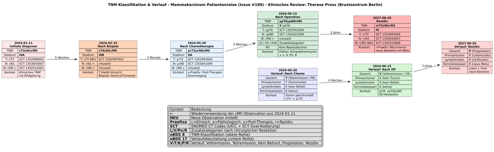

# TNM Mammakarzinom-Patientenreise (Beispiel) - MII IG Kerndatensatz-Modul Onkologie v2026.0.3

* [**Inhaltsverzeichnis**](toc.md)
* [**Anleitung**](guidance.md)
* **TNM Mammakarzinom-Patientenreise (Beispiel)**

## TNM Mammakarzinom-Patientenreise (Beispiel)

### Überblick

Dieses umfassende Beispiel demonstriert die vollständige TNM-Staging-Journey einer Brustkrebspatientin über fünf kritische Zeitpunkte hinweg. Es illustriert die Komplexität realer onkologischer Befundung und zeigt, wie die FHIR-Architektur mit verlinkten Observations die klinische Realität abbildet.

### Grafische Darstellung



> Die Bilddatei wird als `.svg` bereitgestellt und kann zur besseren Darstellung einzeln geöffnet und heruntergeladen werden: [TNM_Breast_Cancer_Journey.svg](TNM_Breast_Cancer_Journey.svg).

### Klinischer Kontext

Die Patientin durchläuft folgende Staging-Phasen:

| | | | |
| :--- | :--- | :--- | :--- |
| Januar 2024 | cT3N1M0 | Initiale klinische Einschätzung | Stadium IIIA |
| Februar 2024 | pT4cN1cM0 | Nach Biopsie - gemischte Bewertung | Stadium IIIB |
| Mai 2024 | ycT2ycN0cM0 | Nach neoadjuvanter Chemotherapie | Stadium IIA |
| Juni 2024 | ypT0ypN0cM0 | Nach Operation - komplette pathologische Remission | Complete Response |
| Juni 2027 | rcT2N1M1 | Rezidiv nach 3 Jahren krankheitsfreiem Intervall | Stadium IV |

### Architektur-Highlights

#### 1. Komponenten-Wiederverwendung

Die initiale `cM0` Observation (Januar 2024) wird in mehreren späteren Klassifikationen referenziert:

* Bei der gemischten Staging nach Biopsie (pT4cN1cM0)
* Nach neoadjuvanter Therapie (ycT2ycN0cM0)
* Bei der postoperativen Bewertung (ypT0ypN0cM0)

Dies zeigt, dass nicht alle TNM-Kategorien bei jeder Staging-Phase neu bewertet werden müssen.

#### 2. Gemischte Assessment-Typen

Das Beispiel `pT4cN1cM0` demonstriert eine häufige klinische Situation:

* **T-Kategorie**: Pathologisch bewertet durch Biopsie (pT4)
* **N-Kategorie**: Klinisch bewertet durch Bildgebung (cN1)
* **M-Kategorie**: Klinisch bewertet durch CT-Scan (cM0)

#### 3. Präfix-Verwendung

**Kategorie-Level Präfixe (c/p):**

* Angewendet auf individuelle TNM-Komponenten
* Zeigen die Bewertungsmethode an (klinisch vs. pathologisch)

**Klassifikations-Level Präfixe (y/r):**

* `y`: Post-neoadjuvante Therapie-Bewertung
* `r`: Rezidiv-Staging nach krankheitsfreiem Intervall

### SNOMED CT Kodierung

Jede TNM-Kategorie enthält zwei Kodierungen:

1. **UICC Code**: Der traditionelle TNM-Wert (z.B.,`T3`,`N1`,`M0`)
1. **SNOMED CT Code**: Spezifischer Code aus der UICC-Qualifier-Value-Hierarchie

Beispiel für cT3:

```
* valueCodeableConcept = $UICC#T3 "T3"
* valueCodeableConcept.coding[+] = $SCT#1352966002 "Union for International Cancer Control cT3 (qualifier value)"

```

### Implementierungshinweise

#### Observation.hasMember Architektur

Die Verwendung von `hasMember` anstelle von `component` ermöglicht:

* **Zeitliche Kohärenz**: Jede Kategorie behält ihr eigenes `effectiveDateTime`
* **Methoden-Tracking**: Unterschiedliche Bewertungsmethoden pro Kategorie
* **Wiederverwendbarkeit**: Einmal erstellte Observations können mehrfach referenziert werden
* **Audit-Trail**: Vollständige Historie wer, wann, wie bewertet hat

#### Warum nicht Observation.component?

Components können nicht:

* Unterschiedliche Bewertungsdaten haben
* Über Observations hinweg wiederverwendet werden
* Eigene Performer oder Methoden haben
* Die komplexe Realität gemischter Assessments abbilden

### Technische Details

#### Verwendete Profile

* [`mii-pr-onko-tnm-klassifikation`](StructureDefinition-mii-pr-onko-tnm-klassifikation.md) (Haupt-TNM-Gruppierung)
* [`mii-pr-onko-tnm-t-kategorie`](StructureDefinition-mii-pr-onko-tnm-t-kategorie.md) (T-Kategorien)
* [`mii-pr-onko-tnm-n-kategorie`](StructureDefinition-mii-pr-onko-tnm-n-kategorie.md) (N-Kategorien)
* [`mii-pr-onko-tnm-m-kategorie`](StructureDefinition-mii-pr-onko-tnm-m-kategorie.md) (M-Kategorien)

#### Extensions

* [`mii-ex-onko-tnm-cp-praefix`](StructureDefinition-mii-ex-onko-tnm-cp-praefix.md): Für c/p Präfixe
* [`mii-ex-onko-tnm-y-praefix`](StructureDefinition-mii-ex-onko-tnm-y-praefix.md): Für Post-Therapie-Markierung
* [`mii-ex-onko-tnm-r-praefix`](StructureDefinition-mii-ex-onko-tnm-r-praefix.md): Für Rezidiv-Markierung

### Beispiel-Instanzen

> Die fünf Staging-Zeitpunkte sind als eigenständige Beispielinstanzen ausgeliefert; die Strukturdarstellung findet sich jeweils auf der Artefaktseite:

* Initiale klinische Staging (cT3N1M0): [mii-exa-onko-tnm-clinical-cT3cN1cM0](Observation-mii-exa-onko-tnm-clinical-cT3cN1cM0.md)
* Gemischte Staging nach Biopsie (pT4cN1cM0): [mii-exa-onko-tnm-biopsy-cT4cN1cM0](Observation-mii-exa-onko-tnm-biopsy-cT4cN1cM0.md) 
* Post-Chemotherapie Staging (ycT2ycN0cM0): [mii-exa-onko-tnm-post-chemo-ycT2ycN0cM0](Observation-mii-exa-onko-tnm-post-chemo-ycT2ycN0cM0.md)
* Post-operative komplette Remission (ypT0ypN0cM0): [mii-exa-onko-tnm-post-surgery-ypT0ypN0cM0](Observation-mii-exa-onko-tnm-post-surgery-ypT0ypN0cM0.md)
* Rezidiv nach 3 Jahren (rcT2N1M1): [mii-exa-onko-tnm-recurrence-rcT2cN1cM1](Observation-mii-exa-onko-tnm-recurrence-rcT2cN1cM1.md) 

### JSON-Repräsentation

> Die vollständige JSON- und XML-Repräsentation ist jeweils auf der Artefaktseite der Instanz hinterlegt:

* Vollständige initiale TNM-Klassifikation: [mii-exa-onko-tnm-clinical-cT3cN1cM0](Observation-mii-exa-onko-tnm-clinical-cT3cN1cM0.md)
* T-Kategorie mit SNOMED Kodierung: [mii-exa-onko-tnm-t-kategorie-cT3](Observation-mii-exa-onko-tnm-t-kategorie-cT3.md)
* Wiederverwendete M-Kategorie: [mii-exa-onko-tnm-m-kategorie-cM0](Observation-mii-exa-onko-tnm-m-kategorie-cM0.md)

### Klinische Validierung

Diese Beispiel-Struktur wurde entwickelt, um folgende klinische Realitäten abzubilden:

* **Biopsie-Upgrades**: Nur T-Kategorie wird pathologisch neu bewertet
* **Neoadjuvante Response**: Vollständige Neubewertung mit y-Präfix
* **Pathologische Komplettremission**: ypT0ypN0 zeigt vollständiges Ansprechen
* **Fernmetastasen-Assessment**: M-Kategorie bleibt oft klinisch, da Fernmetastasen selten biopsiert werden
* **Rezidiv-Dokumentation**: Neue Baseline mit r-Präfix nach krankheitsfreiem Intervall

### Referenzen

* [GitHub Issue #189](https://github.com/medizininformatik-initiative/kerndatensatzmodul-onkologie/issues/189)
* [UICC TNM Classification 8th Edition](https://www.uicc.org/resources/tnm)
* [SNOMED CT UICC Qualifier Values](http://snomed.info/sct)

### Verwendungshinweise für Implementierer

1. **Erstellen Sie TNM-Komponenten nur bei Neubewertung**: Verwenden Sie existierende Observations wieder, wenn keine neue Bewertung erfolgt ist
1. **Verwenden Sie korrekte SNOMED Codes**: Die ConceptMaps[`mii-cm-onko-tnm-uicc-sct-clinical`](ConceptMap-mii-cm-onko-tnm-uicc-sct-clinical.md)und[`mii-cm-onko-tnm-uicc-sct-pathological`](ConceptMap-mii-cm-onko-tnm-uicc-sct-pathological.md)enthalten alle Mappings
1. **Dokumentieren Sie den zeitlichen Kontext**: Das`effectiveDateTime`jeder Komponente sollte den tatsächlichen Bewertungszeitpunkt wiedergeben
1. **Beachten Sie die Präfix-Hierarchie**: y/r-Präfixe gelten für die gesamte Klassifikation, c/p-Präfixe für einzelne Kategorien

### Zusammenfassung

Dieses Beispiel demonstriert die volle Flexibilität und Ausdrucksstärke der MII Onkologie TNM-Profile. Es zeigt, wie die FHIR-Architektur die komplexe Realität onkologischer Staging-Prozesse präzise abbilden kann, während gleichzeitig Datenintegrität und Wiederverwendbarkeit gewährleistet werden.

