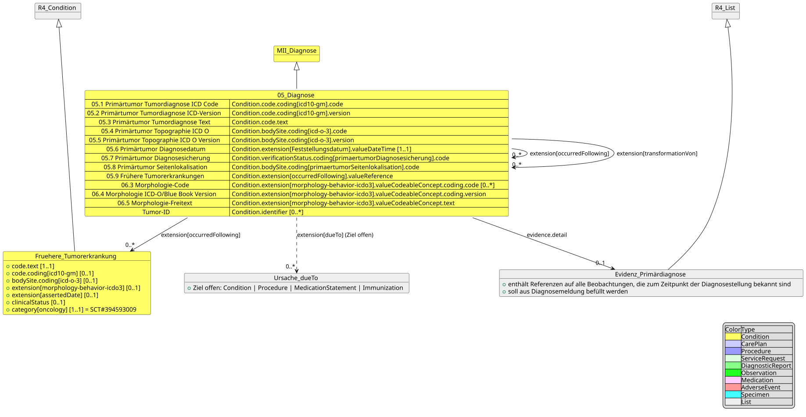
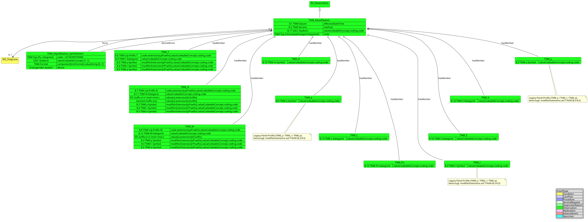
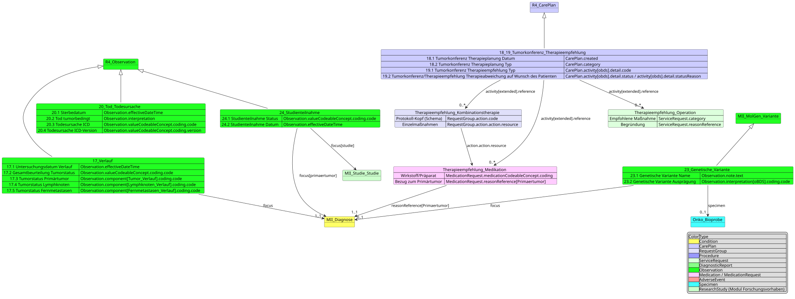
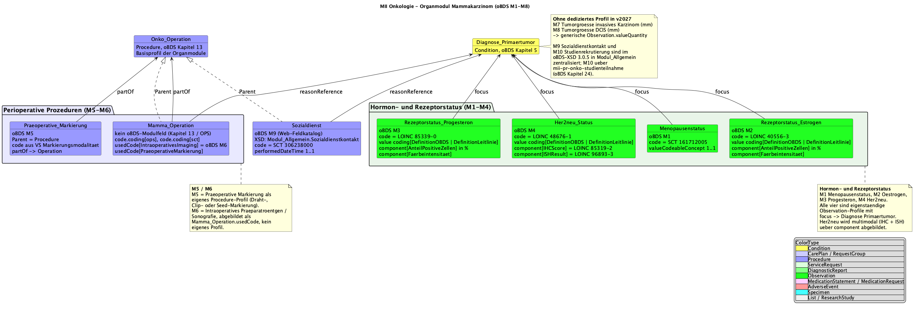
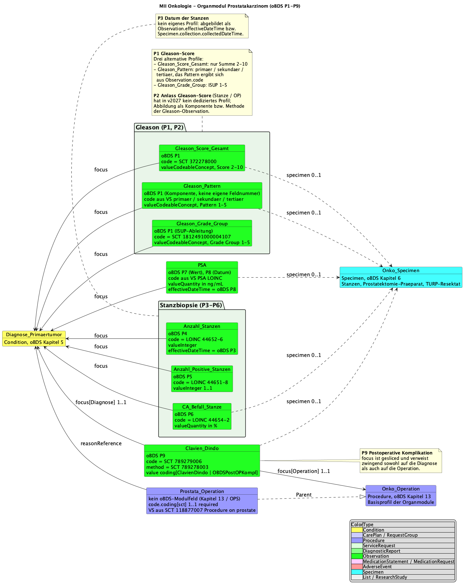
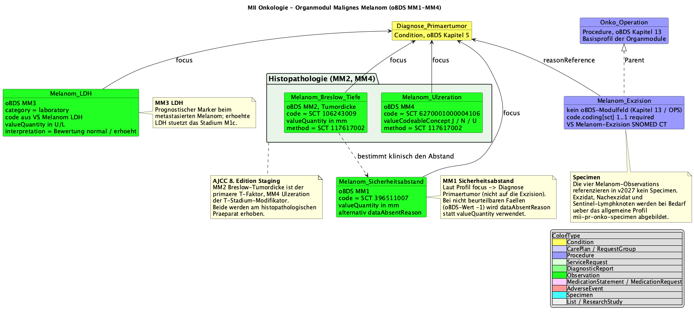

# Profiles - MII IG Kerndatensatz-Modul Onkologie v2026.0.3

* [**Table of Contents**](toc.md)
* **Profiles**

## Profiles

The complete, automatically generated list of all profiles of this module can be found in the [artifact overview](artifacts.md); the domain documentation of each profile appears as an introduction directly on the respective profile page. This page provides the overview: the standards basis, the simplified structure views per oBDS chapter and the organ-specific modules.

### Interactive profile map

Each box links directly to the profile page; colors by FHIR resource type, grouped along the oncological treatment path (oBDS chapters).

oBDS base dataset

##### Diagnosis (oBDS 5)

[Diagnose Primärtumor](StructureDefinition-mii-pr-onko-diagnose-primaertumor.md)
[Frühere Tumorerkrankung](StructureDefinition-mii-pr-onko-fruehere-tumorerkrankung.md)
[Evidenz Erstdiagnose](StructureDefinition-mii-pr-onko-liste-evidenz-erstdiagnose.md)

##### Histology & Pathology (oBDS 6)

[Histologie ICD-O-3](StructureDefinition-mii-pr-onko-histologie-icdo3.md)
[Grading](StructureDefinition-mii-pr-onko-grading.md)
[Tumorgröße](StructureDefinition-mii-pr-onko-tumorgroesse.md)
[Befund](StructureDefinition-mii-pr-onko-befund.md)
[Specimen](StructureDefinition-mii-pr-onko-specimen.md)
[Lymphknoten untersucht](StructureDefinition-mii-pr-onko-anzahl-untersuchte-lymphknoten.md)
[Lymphknoten befallen](StructureDefinition-mii-pr-onko-anzahl-befallene-lymphknoten.md)
[Sentinel untersucht](StructureDefinition-mii-pr-onko-anzahl-untersuchte-sentinel-lymphknoten.md)
[Sentinel befallen](StructureDefinition-mii-pr-onko-anzahl-befallene-sentinel-lymphknoten.md)

##### TNM & Staging (oBDS 8–12)

[TNM-Klassifikation](StructureDefinition-mii-pr-onko-tnm-klassifikation.md)
[TNM synthetisiert](StructureDefinition-mii-pr-onko-tnm-klassifikation-synthetisiert.md)
[T](StructureDefinition-mii-pr-onko-tnm-t-kategorie.md)
[N](StructureDefinition-mii-pr-onko-tnm-n-kategorie.md)
[M](StructureDefinition-mii-pr-onko-tnm-m-kategorie.md)
[L](StructureDefinition-mii-pr-onko-tnm-l-kategorie.md)
[V](StructureDefinition-mii-pr-onko-tnm-v-kategorie.md)
[Pn](StructureDefinition-mii-pr-onko-tnm-pn-kategorie.md)
[S](StructureDefinition-mii-pr-onko-tnm-s-kategorie.md)
[y](StructureDefinition-mii-pr-onko-tnm-y-symbol.md)
[r](StructureDefinition-mii-pr-onko-tnm-r-symbol.md)
[a](StructureDefinition-mii-pr-onko-tnm-a-symbol.md)
[m](StructureDefinition-mii-pr-onko-tnm-m-symbol.md)
[Weitere Klassifikationen](StructureDefinition-mii-pr-onko-weitere-klassifikationen.md)
[Residualstatus](StructureDefinition-mii-pr-onko-residualstatus.md)
[Fernmetastasen](StructureDefinition-mii-pr-onko-fernmetastasen.md)
[ECOG](StructureDefinition-mii-pr-onko-allgemeiner-leistungszustand-ecog.md)
[Karnofsky](StructureDefinition-mii-pr-onko-allgemeiner-leistungszustand-karnofsky.md)
[ASA](StructureDefinition-mii-pr-onko-asa-klassifikation.md)

##### Therapy (oBDS 13–16)

[Operation](StructureDefinition-mii-pr-onko-operation.md)
[Strahlentherapie](StructureDefinition-mii-pr-onko-strahlentherapie.md)
[Bestrahlung](StructureDefinition-mii-pr-onko-strahlentherapie-bestrahlung-strahlentherapie.md)
[Nuklearmedizin](StructureDefinition-mii-pr-onko-strahlentherapie-bestrahlung-nuklearmedizin.md)
[Systemische Therapie](StructureDefinition-mii-pr-onko-systemische-therapie.md)
[Medikation](StructureDefinition-mii-pr-onko-systemische-therapie-medikation.md)
[Nebenwirkung](StructureDefinition-mii-pr-onko-nebenwirkung-adverse-event.md)

##### Follow-up, Conference & Closure (oBDS 17–20)

[Verlauf](StructureDefinition-mii-pr-onko-verlauf.md)
[Tumorkonferenz](StructureDefinition-mii-pr-onko-tumorkonferenz.md)
[Empf. Kombinationstherapie](StructureDefinition-mii-pr-onko-therapieempfehlung-kombinationstherapie.md)
[Empf. Medikation](StructureDefinition-mii-pr-onko-therapieempfehlung-medikation.md)
[Empf. Operation](StructureDefinition-mii-pr-onko-therapieempfehlung-operation.md)
[Tod](StructureDefinition-mii-pr-onko-tod.md)

##### Genetics & Studies (oBDS 23–24)

[Genetische Variante](StructureDefinition-mii-pr-onko-genetische-variante.md)
[Studienteilnahme](StructureDefinition-mii-pr-onko-studienteilnahme.md)

Organ-specific modules

##### Breast

[Estrogen-Rezeptor](StructureDefinition-mii-pr-onko-mamma-rezeptorstatus-estrogen.md)
[Progesteron-Rezeptor](StructureDefinition-mii-pr-onko-mamma-rezeptorstatus-progesteron.md)
[HER2/neu](StructureDefinition-mii-pr-onko-mamma-her2neu-status.md)
[Menopause-Status](StructureDefinition-mii-pr-onko-mamma-menopause-status.md)
[Präop. Markierung](StructureDefinition-mii-pr-onko-mamma-praeoperative-markierung.md)
[Mamma-OP](StructureDefinition-mii-pr-onko-mamma-operation.md)
[Sozialdienst](StructureDefinition-mii-pr-onko-mamma-sozialdienst.md)

##### Prostate

[PSA](StructureDefinition-mii-pr-onko-prostate-psa.md)
[Gleason Patterns](StructureDefinition-mii-pr-onko-prostate-gleason-patterns.md)
[Gleason Score](StructureDefinition-mii-pr-onko-prostate-gleason-score-gesamt.md)
[Grade Group](StructureDefinition-mii-pr-onko-prostate-gleason-grade-group.md)
[Anzahl Stanzen](StructureDefinition-mii-pr-onko-prostate-anzahl-stanzen.md)
[Positive Stanzen](StructureDefinition-mii-pr-onko-prostate-anzahl-positive-stanzen.md)
[Befall Stanze](StructureDefinition-mii-pr-onko-prostate-ca-befall-stanze.md)
[Clavien-Dindo](StructureDefinition-mii-pr-onko-prostate-clavien-dindo.md)
[Prostata-OP](StructureDefinition-mii-pr-onko-prostata-operation.md)

##### Colorectal

[Abstand Anokutanlinie](StructureDefinition-mii-pr-onko-krk-abstand-anokutan.md)
[Abstand aboral](StructureDefinition-mii-pr-onko-krk-abstand-aboral.md)
[CRM/Resektionsebene](StructureDefinition-mii-pr-onko-krk-abstand-circumferelle-resektionsebene.md)
[MRT mesorektale Faszie](StructureDefinition-mii-pr-onko-krk-mrt-mesorektale-faszie.md)
[Anastomoseninsuffizienz](StructureDefinition-mii-pr-onko-krk-anastomoseninsuffizienz.md)
[KRK-OP](StructureDefinition-mii-pr-onko-krk-operation.md)
[Stoma-Markierung](StructureDefinition-mii-pr-onko-krk-stoma-markierung.md)
[KRK-Specimen](StructureDefinition-mii-pr-onko-krk-specimen.md)

##### Melanoma

[Breslow-Tiefe](StructureDefinition-mii-pr-onko-melanom-breslow-tiefe.md)
[Ulzeration](StructureDefinition-mii-pr-onko-melanom-ulzeration.md)
[Sicherheitsabstand](StructureDefinition-mii-pr-onko-melanom-sicherheitsabstand.md)
[LDH](StructureDefinition-mii-pr-onko-melanom-ldh.md)
[Exzision](StructureDefinition-mii-pr-onko-melanom-exzision.md)

Condition
Observation
Procedure
CarePlan
MedicationStatement
AdverseEvent
Specimen
DiagnosticReport

### Standards basis

The CDS specifications are based, where possible, on international standards and terminologies — notably the [International Patient Summary](http://hl7.org/fhir/uv/ips/history.html). Adaptation to the German healthcare system is achieved through the [German FHIR base profiles](https://simplifier.net/basisprofil-de-r4) of HL7 Germany; compatibility with the FHIR specifications of the National Association of Statutory Health Insurance Physicians (KBV) is also sought.

### Simplified profile views (inheritance and oBDS mapping)

The following shows the profiles in a simplified version, focusing on the inheritance from other profiles and the mapping of oBDS data fields to the corresponding FHIR elements.

#### Diagnosis

The diagnosis contains information on the primary diagnosis itself as well as on histology and localization of the primary tumor.

#### Histology

#### TNM classification

#### Further classifications, residual status, performance status, distant metastases

#### Procedures, medication and adverse events

#### Follow-up, tumor conference, death and genetic variant

### Lymph node examinations

Four profiles describe the lymph node examinations performed as part of oncological staging. The oBDS provides four distinct data points:

* [Number of examined lymph nodes](StructureDefinition-mii-pr-onko-anzahl-untersuchte-lymphknoten.md)
* [Number of affected lymph nodes](StructureDefinition-mii-pr-onko-anzahl-befallene-lymphknoten.md)
* [Number of examined sentinel lymph nodes](StructureDefinition-mii-pr-onko-anzahl-untersuchte-sentinel-lymphknoten.md)
* [Number of affected sentinel lymph nodes](StructureDefinition-mii-pr-onko-anzahl-befallene-sentinel-lymphknoten.md)

The ratio between affected and examined lymph nodes is sometimes determined in clinical practice but is not a separate data point in the oBDS.

### Organ-specific modules

The organ-specific modules extend the base module with **entity-specific data elements** according to the requirements of the ADT/GEKID base documentation. They address the particular diagnostic and therapeutic aspects of individual tumor entities.

#### Breast (Mamma)

The breast module implements the organ-specific profiles for breast-cancer data according to the [oBDS module breast cancer](https://www.basisdatensatz.de/module/5/mammakarzinom): receptor-status determinations (estrogen/progesterone with staining intensity and share of positive cells), menopause status, preoperative marking modalities, intraoperative imaging and breast-specific surgical procedures. The HER2/neu status is currently represented in the molecular tumor board profile; tumor size was moved to the histology chapter as it applies to multiple entities.

#### Prostate

The prostate module covers PSA values as the central tumor marker, Gleason scoring (primary, secondary and tertiary patterns), grade groups (1–5), biopsy results (number of cores, carcinoma involvement) and postoperative complications per Clavien-Dindo.

#### Colorectal carcinoma (CRC)

The CRC module covers the preoperative assessment (distance to the anocutaneous line, MRI-based measurement of the mesorectal fascia, ASA classification), CRC-specific surgical procedures and stoma marking, resection margins (aboral and circumferential/CRM), anastomotic-leak grading and specific specimen profiles for CRC resections.

#### Malignant melanoma

The melanoma profiles cover Breslow depth (LOINC 39092-1) as the most important prognostic factor, ulceration of the primary tumor (SNOMED CT 385324008), the excision safety margin, LDH as a prognostic marker and melanoma-specific excision procedures.

