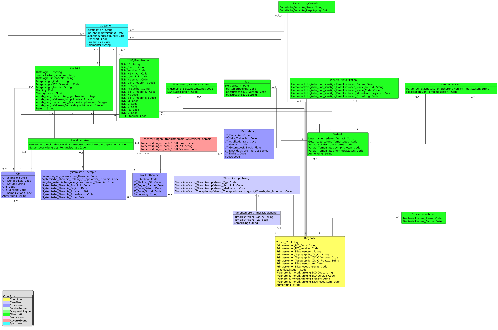

# UML Diagrams - MII IG Kerndatensatz-Modul Onkologie v2027.0.0-ballot.rc1

* [**Table of Contents**](toc.md)
* [**Guidance**](guidance.md)
* **UML Diagrams**

## UML Diagrams

The following UML diagram shows the implemented content and cardinalities of the oBDS as realized by the CDS module Oncology.

### Organ-specific modules — UML diagrams

In addition to the overarching UML diagram, each organ-specific module has its own detailed architecture diagrams — see the sections on the [profiles page](profiles.md):

* [Breast module](profiles.md) — breast-cancer-specific profiles and their relationships
* [Prostate module](profiles.md) — prostate-cancer-specific profiles and their relationships
* [CRC module](profiles.md) — colorectal-carcinoma-specific profiles and their relationships
* [Melanoma module](profiles.md) — malignant-melanoma-specific profiles and their relationships

The structure of all organ-specific modules is additionally formally defined in the [logical model](StructureDefinition-mii-lm-onko.md), which provides the FHIR mappings for all entity-specific data elements.

