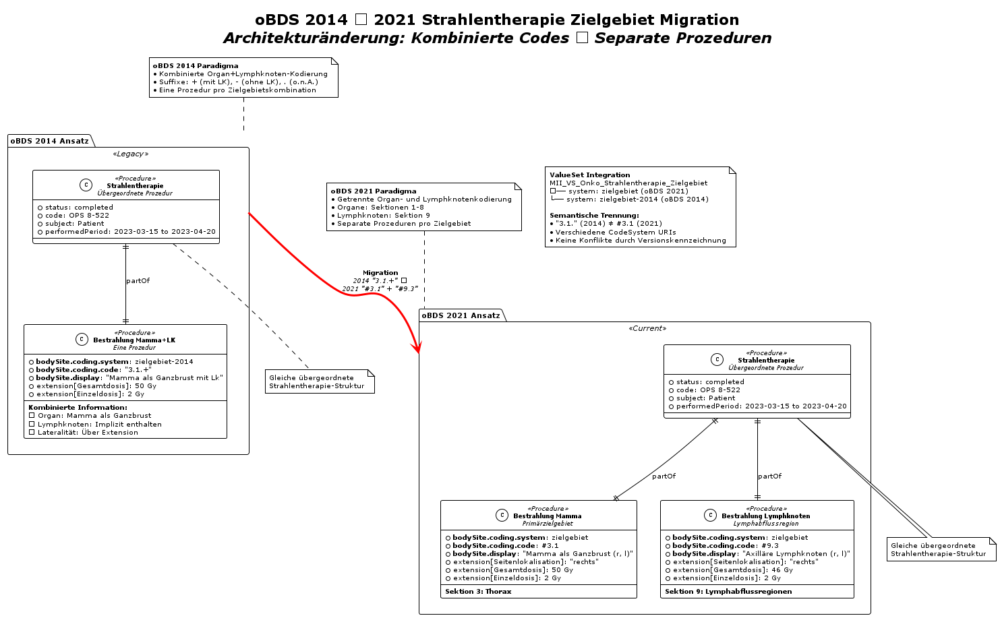

# MII PR Onkologie Strahlentherapie - MII IG Kerndatensatz-Modul Onkologie v2027.0.0-ballot.rc1

* [**Table of Contents**](toc.md)
* [**Artifacts Summary**](artifacts.md)
* **MII PR Onkologie Strahlentherapie**

## Resource Profile: MII PR Onkologie Strahlentherapie 

| | |
| :--- | :--- |
| *Official URL*:https://www.medizininformatik-initiative.de/fhir/ext/modul-onko/StructureDefinition/mii-pr-onko-strahlentherapie | *Version*:2027.0.0-ballot.rc1 |
| Active as of 2026-09-03 | *Computable Name*:MII_PR_Onko_Strahlentherapie |

 
Strahlentherapie. Dieses Profil beschreibt eine Strahlentherapie in der Onkologie. 

This profile describes a radiotherapy in oncology. The radiotherapy profile for oncology is based on the MII procedure module. It thus adopts the mandatory specification of OPS as the coding for the type of procedure. Since the details of the procedure are recorded in the individual radiation elements, the OPS for radiotherapy should be coded here.

The MII procedure module already has an extension [intent of the procedure](https://www.medizininformatik-initiative.de/fhir/core/modul-prozedur/StructureDefinition/Durchfuehrungsabsicht) with a binding to SNOMED CT codes. However, since the intention of radiotherapy in the oBDS is captured via an oBDS-specific answer set, the procedure was extended with an additional element "Intention". Likewise, the relationship to any surgeries (e.g. adjuvant/neoadjuvant) is captured via the extension element "Stellung".

The specific details of the radiotherapy are subdivided into individual radiations and reported accordingly. Each radiation is captured as an extension.

Complications of the radiotherapy are not coded as `Procedure.complication` or `Procedure.complicationReference`, but, as with systemic therapy, are captured in a separate AdverseEvent resource with a reference to the radiotherapy resource. Note that a reference to the radiotherapy resource points non-specifically to the complete radiotherapy and not to individual radiations.

The reason for termination (regardless of whether successful or unsuccessful) is coded via `Procedure.outcome`.

### Structure

The decision to implement the radiation data as an extension has several reasons.

1. The data structure of the oBDS provides for specifying an overall radiotherapy period with a start and end, as well as an overall intention and relation-to-surgery data point. All further structured treatment information on the radiation (radiation type, location, dose, boost etc.) should be coded individually in an element "Bestrahlung".
1. The MII procedure requires that every procedure has exactly one code, either OPS or SNOMED CT.
1. The US American FHIR data model mCODE maps the relevant data points in extensions. It should be noted, however, that mCODE makes no distinction here between an overarching radiotherapy and a subordinate radiation. However, mCODE does also provide for detailed information on the size of the target volume.

Alternatively, an implementation was also discussed in which the overarching radiotherapy would remain as a profile conformant to the MII procedure, and the subordinate radiations would be profiled from the regular `Procedure`. This profiling was discarded because of the larger number of resources required and the anticipated difficulty of correctly assigning the OPS/SNOMED code.

### Category and codes

#### Category

* The MII procedure used recommends mapping the **category** using the OPS main categories transferred into SNOMED (https://www.medizininformatik-initiative.de/fhir/core/modul-prozedur/ValueSet/procedures-category-sct)
* The present category SNOMED `277132007 | Therapeutic procedure` , which corresponds to OPS category 8 ("Non-operative therapeutic measures"), includes both radiotherapy and nuclear medicine therapy as well as certain systemic therapies (e.g. chemotherapy and immunotherapy), whereas other systemic drug therapies (e.g. hormone therapy, targeted therapy) can also be coded under category 6 "Medications". It is therefore non-specific and not suitable, for example, for specifically filtering for nuclear medicine therapies within a research question.

#### Code

* The MII procedure requires an OPS code or a SNOMED code as the **code**.
* OPS includes codes for radiotherapy (`8-52`) and nuclear medicine treatment (`8-53`) with detailed sub-codings. In the oBDS itself, however, radiotherapy and nuclear medicine are not coded via OPS, but instead follow a cancer-registry-specific coding of location, application type and radiation type as well as further data points.
* In the MII procedure, exactly one coding (OPS or SNOMED CT) SHOULD be used for exactly one therapy. Additional procedures are mapped as individual Procedure resources.

#### Implementation recommendation

The following coding recommendation for oBDS radiotherapy results from the points mentioned above:

* Category as SNOMED code 
* Category for radiotherapy `1287742003 | Radiotherapy (procedure)`
* Category for nuclear medicine `399315003 | Radionuclide therapy (procedure)`
 
* Coding via OPS 
* Radiotherapy as OPS `8-52 Strahlentherapie` (or more specific if available)
* Nuclear medicine therapy as OPS `8-53 Nuklearmedizinische Therapie` (or more specific if available)
 

### oBDS 2014 to 2021 target region migration

The radiotherapy target region coding has changed fundamentally between oBDS 2014 and 2021:



#### Migration strategy

* **oBDS 2014**: Used combined codes with suffixes (`+` with lymph nodes, `-` without lymph nodes, `.` without further specification)
* **oBDS 2021**: Separates organs (sections 1-8) and lymphatic drainage regions (section 9) into separate radiations
* **Example**: oBDS 2014 code `"3.1.+"` (breast with lymph nodes) becomes two separate codes: `#3.1` (breast) and `#9.3` (axillary lymph nodes)
* **ValueSet**: Supports both CodeSystems for backward compatibility

-------

### Conformance

This profiling is compatible with the procedure profile of the ISiK base modules level 4. https://simplifier.net/isik-basis-v4/isikprozedur

-------

Mapping dataset to FHIR

> The mapping of the dataset fields is documented in the logical model: [MII LM Onkologie](StructureDefinition-mii-lm-onko.md).

-------

Mapping [Einheitlicher onkologischer Basisdatensatz (oBDS)](https://basisdatensatz.de/basisdatensatz) to FHIR

> The oBDS mappings are recorded in the artefact view of this profile: [MII PR Onkologie Strahlentherapie](StructureDefinition-mii-pr-onko-strahlentherapie.md).

**Examples**

`mii-exa-onko-strahlentherapie` 

**Usages:**

* Refer to this Profile: [MII PR Onkologie Diagnose Primärtumor](StructureDefinition-mii-pr-onko-diagnose-primaertumor.md) and [MII PR Onkologie Nebenwirkung von Strahlentherapie und systemische Therapie](StructureDefinition-mii-pr-onko-nebenwirkung-adverse-event.md)
* Examples for this Profile: [Procedure/mii-exa-onko-strahlentherapie-nuklearmedizin-1](Procedure-mii-exa-onko-strahlentherapie-nuklearmedizin-1.md), [Procedure/mii-exa-onko-strahlentherapie-pci-sclc](Procedure-mii-exa-onko-strahlentherapie-pci-sclc.md) and [Procedure/mii-exa-onko-strahlentherapie-strahlentherapie-1](Procedure-mii-exa-onko-strahlentherapie-strahlentherapie-1.md)
* CapabilityStatements using this Profile: [MII CPS Onkology CapabilityStatement](CapabilityStatement-mii-cps-onko-capabilitystatement.md)

You can also check for [usages in the FHIR IG Statistics](https://packages2.fhir.org/xig/resource/de.medizininformatikinitiative.kerndatensatz.onkologie|current/StructureDefinition/StructureDefinition-mii-pr-onko-strahlentherapie.json)

### Formal Views of Profile Content

 [Description of Profiles, Differentials, Snapshots, and their representations](http://build.fhir.org/ig/FHIR/ig-guidance/readingIgs.html#structure-definitions). 

 

Other representations of profile: [CSV](../StructureDefinition-mii-pr-onko-strahlentherapie.csv), [Excel](../StructureDefinition-mii-pr-onko-strahlentherapie.xlsx), [Schematron](../StructureDefinition-mii-pr-onko-strahlentherapie.sch) 


## Resource Content

```json
{
  "resourceType" : "StructureDefinition",
  "id" : "mii-pr-onko-strahlentherapie",
  "meta" : {
    "profile" : ["http://hl7.org/fhir/uv/crmi/StructureDefinition/crmi-shareablestructuredefinition",
    "http://hl7.org/fhir/uv/crmi/StructureDefinition/crmi-publishablestructuredefinition"]
  },
  "extension" : [{
    "url" : "http://hl7.org/fhir/StructureDefinition/artifact-versionAlgorithm",
    "valueCoding" : {
      "system" : "http://hl7.org/fhir/version-algorithm",
      "code" : "semver",
      "display" : "SemVer"
    }
  },
  {
    "url" : "http://hl7.org/fhir/StructureDefinition/cqf-knowledgeCapability",
    "valueCode" : "shareable"
  },
  {
    "url" : "http://hl7.org/fhir/StructureDefinition/cqf-knowledgeCapability",
    "valueCode" : "publishable"
  },
  {
    "url" : "http://hl7.org/fhir/StructureDefinition/artifact-versionPolicy",
    "valueCodeableConcept" : {
      "coding" : [{
        "system" : "http://terminology.hl7.org/CodeSystem/artifact-version-policy-codes",
        "version" : "3.0.0",
        "code" : "package",
        "display" : "Package"
      }]
    }
  },
  {
    "url" : "http://hl7.org/fhir/StructureDefinition/artifact-usage",
    "valueMarkdown" : "Use this profile as the technical FHIR representation of the corresponding Medical Informatics Initiative logical model. The profile constrains a base FHIR resource for the MII module context by specifying how elements are used, which elements are required or not used, which extensions and terminology bindings apply, and how the resource maps to the module-specific content model. Implementers should produce and consume resource instances that conform to this profile when exchanging data for the corresponding MII module."
  },
  {
    "url" : "http://hl7.org/fhir/StructureDefinition/artifact-topic",
    "valueCodeableConcept" : {
      "coding" : [{
        "system" : "http://ncicb.nci.nih.gov/xml/owl/EVS/Thesaurus.owl",
        "code" : "C3262"
      }]
    }
  },
  {
    "url" : "http://hl7.org/fhir/StructureDefinition/artifact-author",
    "valueContactDetail" : {
      "telecom" : [{
        "system" : "email",
        "value" : "thomas.debertshaeuser@charite.de"
      }]
    }
  },
  {
    "url" : "http://hl7.org/fhir/StructureDefinition/artifact-editor",
    "valueContactDetail" : {
      "name" : "Taskforce Core Data Set"
    }
  },
  {
    "url" : "http://hl7.org/fhir/StructureDefinition/artifact-reviewer",
    "valueContactDetail" : {
      "name" : "Interoperability Working Group",
      "telecom" : [{
        "system" : "url",
        "value" : "https://www.medizininformatik-initiative.de/en/collaboration/interoperability-working-group"
      }]
    }
  },
  {
    "url" : "http://hl7.org/fhir/StructureDefinition/artifact-reviewer",
    "valueContactDetail" : {
      "name" : "National Steering Committee",
      "telecom" : [{
        "system" : "url",
        "value" : "https://www.medizininformatik-initiative.de/en/collaboration/national-steering-committee"
      }]
    }
  },
  {
    "url" : "http://hl7.org/fhir/StructureDefinition/artifact-endorser",
    "valueContactDetail" : {
      "name" : "Interoperability Working Group",
      "telecom" : [{
        "system" : "url",
        "value" : "https://www.medizininformatik-initiative.de/en/collaboration/interoperability-working-group"
      }]
    }
  },
  {
    "url" : "http://hl7.org/fhir/StructureDefinition/artifact-endorser",
    "valueContactDetail" : {
      "name" : "National Steering Committee",
      "telecom" : [{
        "system" : "url",
        "value" : "https://www.medizininformatik-initiative.de/en/collaboration/national-steering-committee"
      }]
    }
  },
  {
    "url" : "http://hl7.org/fhir/StructureDefinition/resource-approvalDate",
    "valueDate" : "2026-01-03"
  },
  {
    "url" : "http://hl7.org/fhir/StructureDefinition/resource-effectivePeriod",
    "valuePeriod" : {
      "start" : "2027"
    }
  }],
  "url" : "https://www.medizininformatik-initiative.de/fhir/ext/modul-onko/StructureDefinition/mii-pr-onko-strahlentherapie",
  "version" : "2027.0.0-ballot.rc1",
  "name" : "MII_PR_Onko_Strahlentherapie",
  "title" : "MII PR Onkologie Strahlentherapie",
  "status" : "active",
  "date" : "2026-09-03T19:21:23+00:00",
  "publisher" : "Medizininformatik Initiative",
  "contact" : [{
    "name" : "Medizininformatik Initiative",
    "telecom" : [{
      "system" : "url",
      "value" : "https://www.medizininformatik-initiative.de/"
    }]
  }],
  "description" : "Strahlentherapie. Dieses Profil beschreibt eine Strahlentherapie in der Onkologie.",
  "jurisdiction" : [{
    "coding" : [{
      "system" : "urn:iso:std:iso:3166",
      "code" : "DE",
      "display" : "Germany"
    }]
  }],
  "fhirVersion" : "4.0.1",
  "mapping" : [{
    "identity" : "oBDS",
    "name" : "Mapping FHIR zu oBDS"
  },
  {
    "identity" : "workflow",
    "uri" : "http://hl7.org/fhir/workflow",
    "name" : "Workflow Pattern"
  },
  {
    "identity" : "w5",
    "uri" : "http://hl7.org/fhir/fivews",
    "name" : "FiveWs Pattern Mapping"
  },
  {
    "identity" : "v2",
    "uri" : "http://hl7.org/v2",
    "name" : "HL7 v2 Mapping"
  }],
  "kind" : "resource",
  "abstract" : false,
  "type" : "Procedure",
  "baseDefinition" : "https://www.medizininformatik-initiative.de/fhir/core/modul-prozedur/StructureDefinition/Procedure",
  "derivation" : "constraint",
  "differential" : {
    "element" : [{
      "id" : "Procedure",
      "path" : "Procedure",
      "mapping" : [{
        "identity" : "oBDS",
        "map" : "14",
        "comment" : "Strahlentherapie"
      }]
    },
    {
      "id" : "Procedure.extension",
      "path" : "Procedure.extension",
      "min" : 1
    },
    {
      "id" : "Procedure.extension:Intention",
      "path" : "Procedure.extension",
      "sliceName" : "Intention",
      "short" : "Intention der Strahlentherapie",
      "_short" : {
        "extension" : [{
          "extension" : [{
            "url" : "lang",
            "valueCode" : "de-DE"
          },
          {
            "url" : "content",
            "valueString" : "Intention der Strahlentherapie"
          }],
          "url" : "http://hl7.org/fhir/StructureDefinition/translation"
        }]
      },
      "definition" : "Intention der Strahlentherapie gemäß 14.1 oBDS 2021.",
      "_definition" : {
        "extension" : [{
          "extension" : [{
            "url" : "lang",
            "valueCode" : "de-DE"
          },
          {
            "url" : "content",
            "valueString" : "Intention der Strahlentherapie gemäß 14.1 oBDS 2021."
          }],
          "url" : "http://hl7.org/fhir/StructureDefinition/translation"
        }]
      },
      "min" : 1,
      "max" : "1",
      "type" : [{
        "code" : "Extension",
        "profile" : ["https://www.medizininformatik-initiative.de/fhir/ext/modul-onko/StructureDefinition/mii-ex-onko-strahlentherapie-intention"]
      }],
      "mustSupport" : true
    },
    {
      "id" : "Procedure.extension:Intention.value[x].coding.code",
      "path" : "Procedure.extension.value[x].coding.code",
      "mapping" : [{
        "identity" : "oBDS",
        "map" : "14.1",
        "comment" : "Intention der Strahlentherapie"
      }]
    },
    {
      "id" : "Procedure.extension:StellungZurOp",
      "path" : "Procedure.extension",
      "sliceName" : "StellungZurOp",
      "short" : "Stellung der Strahlentherapie zu einer Operation",
      "_short" : {
        "extension" : [{
          "extension" : [{
            "url" : "lang",
            "valueCode" : "de-DE"
          },
          {
            "url" : "content",
            "valueString" : "Stellung der Strahlentherapie zu einer Operation"
          }],
          "url" : "http://hl7.org/fhir/StructureDefinition/translation"
        }]
      },
      "definition" : "Stellung der Strahlentherapie zu einer Operation gemäß 14.2 oBDS 2021.",
      "_definition" : {
        "extension" : [{
          "extension" : [{
            "url" : "lang",
            "valueCode" : "de-DE"
          },
          {
            "url" : "content",
            "valueString" : "Stellung der Strahlentherapie zu einer Operation gemäß 14.2 oBDS 2021."
          }],
          "url" : "http://hl7.org/fhir/StructureDefinition/translation"
        }]
      },
      "min" : 0,
      "max" : "*",
      "type" : [{
        "code" : "Extension",
        "profile" : ["https://www.medizininformatik-initiative.de/fhir/ext/modul-onko/StructureDefinition/mii-ex-onko-strahlentherapie-stellungzurop"]
      }],
      "mustSupport" : true
    },
    {
      "id" : "Procedure.extension:StellungZurOp.value[x].coding.code",
      "path" : "Procedure.extension.value[x].coding.code",
      "mapping" : [{
        "identity" : "oBDS",
        "map" : "14.2",
        "comment" : "Strahlentherapie Stellung zu operativer Therapie"
      }]
    },
    {
      "id" : "Procedure.basedOn",
      "path" : "Procedure.basedOn",
      "slicing" : {
        "discriminator" : [{
          "type" : "type",
          "path" : "$this.resolve()"
        }],
        "rules" : "open"
      },
      "type" : [{
        "code" : "Reference",
        "targetProfile" : ["http://hl7.org/fhir/StructureDefinition/CarePlan"]
      }],
      "mustSupport" : true
    },
    {
      "id" : "Procedure.basedOn:tumorkonferenz",
      "path" : "Procedure.basedOn",
      "sliceName" : "tumorkonferenz",
      "min" : 0,
      "max" : "1",
      "type" : [{
        "code" : "Reference",
        "targetProfile" : ["https://www.medizininformatik-initiative.de/fhir/ext/modul-onko/StructureDefinition/mii-pr-onko-tumorkonferenz"]
      }],
      "mustSupport" : true
    },
    {
      "id" : "Procedure.partOf",
      "path" : "Procedure.partOf",
      "type" : [{
        "code" : "Reference",
        "targetProfile" : ["http://hl7.org/fhir/StructureDefinition/Observation"]
      }],
      "mustSupport" : true
    },
    {
      "id" : "Procedure.subject",
      "path" : "Procedure.subject",
      "type" : [{
        "code" : "Reference",
        "targetProfile" : ["http://hl7.org/fhir/StructureDefinition/Patient"]
      }]
    },
    {
      "id" : "Procedure.performed[x]",
      "path" : "Procedure.performed[x]",
      "type" : [{
        "code" : "Period"
      }]
    },
    {
      "id" : "Procedure.performed[x].start",
      "path" : "Procedure.performed[x].start",
      "mapping" : [{
        "identity" : "oBDS",
        "map" : "14.5",
        "comment" : "Strahlentherapie Beginn"
      }]
    },
    {
      "id" : "Procedure.performed[x].end",
      "path" : "Procedure.performed[x].end",
      "mapping" : [{
        "identity" : "oBDS",
        "map" : "14.6",
        "comment" : "Strahlentherapie Ende"
      }]
    },
    {
      "id" : "Procedure.performed[x]:performedPeriod",
      "path" : "Procedure.performed[x]",
      "sliceName" : "performedPeriod",
      "type" : [{
        "code" : "Period"
      }]
    },
    {
      "id" : "Procedure.performed[x]:performedPeriod.start",
      "path" : "Procedure.performed[x].start",
      "short" : "Start der Strahlentherapie",
      "_short" : {
        "extension" : [{
          "extension" : [{
            "url" : "lang",
            "valueCode" : "de-DE"
          },
          {
            "url" : "content",
            "valueString" : "Start der Strahlentherapie"
          }],
          "url" : "http://hl7.org/fhir/StructureDefinition/translation"
        }]
      },
      "definition" : "Start der gesamten Strahlentherapie mit allen Einzelbestrahlungen gemäß 14.5 oBDS 2021.",
      "_definition" : {
        "extension" : [{
          "extension" : [{
            "url" : "lang",
            "valueCode" : "de-DE"
          },
          {
            "url" : "content",
            "valueString" : "Start der gesamten Strahlentherapie mit allen Einzelbestrahlungen gemäß 14.5 oBDS 2021."
          }],
          "url" : "http://hl7.org/fhir/StructureDefinition/translation"
        }]
      },
      "min" : 1,
      "mustSupport" : true
    },
    {
      "id" : "Procedure.performed[x]:performedPeriod.end",
      "path" : "Procedure.performed[x].end",
      "short" : "Ende der Strahlentherapie",
      "_short" : {
        "extension" : [{
          "extension" : [{
            "url" : "lang",
            "valueCode" : "de-DE"
          },
          {
            "url" : "content",
            "valueString" : "Ende der Strahlentherapie"
          }],
          "url" : "http://hl7.org/fhir/StructureDefinition/translation"
        }]
      },
      "definition" : "Ende der gesamten Strahlentherapie mit allen Einzelbestrahlungen gemäß 14.6 oBDS 2021.",
      "_definition" : {
        "extension" : [{
          "extension" : [{
            "url" : "lang",
            "valueCode" : "de-DE"
          },
          {
            "url" : "content",
            "valueString" : "Ende der gesamten Strahlentherapie mit allen Einzelbestrahlungen gemäß 14.6 oBDS 2021."
          }],
          "url" : "http://hl7.org/fhir/StructureDefinition/translation"
        }]
      },
      "comment" : "Bei Permanentstrahlern (Seeds, typischerweise interstitielle LDR-Brachytherapie) ist gemäß oBDS der Tag der Applikation als Ende zu dokumentieren — Beginn und Ende sind dann identisch.",
      "mustSupport" : true
    },
    {
      "id" : "Procedure.reasonReference",
      "path" : "Procedure.reasonReference",
      "type" : [{
        "code" : "Reference",
        "targetProfile" : ["https://www.medizininformatik-initiative.de/fhir/ext/modul-onko/StructureDefinition/mii-pr-onko-diagnose-primaertumor",
        "http://hl7.org/fhir/StructureDefinition/Condition"]
      }],
      "mustSupport" : true
    },
    {
      "id" : "Procedure.outcome",
      "path" : "Procedure.outcome",
      "mustSupport" : true
    },
    {
      "id" : "Procedure.outcome.coding",
      "path" : "Procedure.outcome.coding",
      "short" : "Grund für Ende der Strahlentherapie",
      "_short" : {
        "extension" : [{
          "extension" : [{
            "url" : "lang",
            "valueCode" : "de-DE"
          },
          {
            "url" : "content",
            "valueString" : "Grund für Ende der Strahlentherapie"
          }],
          "url" : "http://hl7.org/fhir/StructureDefinition/translation"
        }]
      },
      "definition" : "Grund für Ende der Strahlentherapie - planmäßig oder abgebrochen -  gemäß 14.12 oBDS 2021.",
      "_definition" : {
        "extension" : [{
          "extension" : [{
            "url" : "lang",
            "valueCode" : "de-DE"
          },
          {
            "url" : "content",
            "valueString" : "Grund für Ende der Strahlentherapie - planmäßig oder abgebrochen -  gemäß 14.12 oBDS 2021."
          }],
          "url" : "http://hl7.org/fhir/StructureDefinition/translation"
        }]
      },
      "mustSupport" : true,
      "binding" : {
        "strength" : "required",
        "valueSet" : "https://www.medizininformatik-initiative.de/fhir/ext/modul-onko/ValueSet/mii-vs-strahlentherapie-ende-grund"
      }
    },
    {
      "id" : "Procedure.outcome.coding.system",
      "path" : "Procedure.outcome.coding.system",
      "mustSupport" : true
    },
    {
      "id" : "Procedure.outcome.coding.code",
      "path" : "Procedure.outcome.coding.code",
      "mustSupport" : true,
      "mapping" : [{
        "identity" : "oBDS",
        "map" : "14.13",
        "comment" : "Strahlentherapie Ende Grund"
      }]
    }]
  }
}

```
