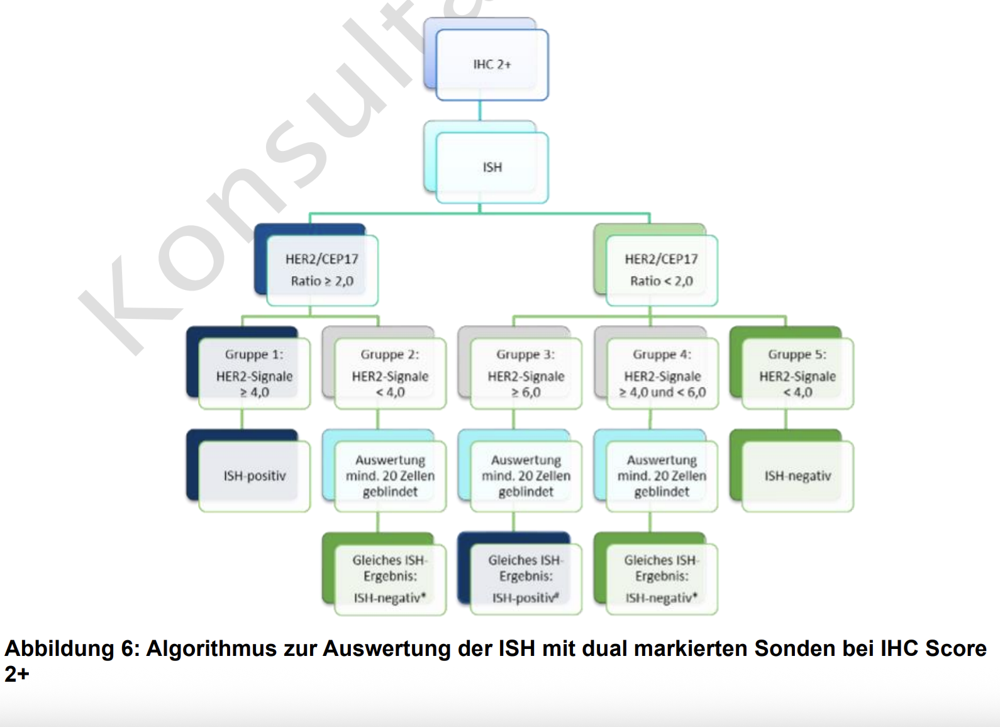

# MII PR Onkologie Her2neu Status - MII IG Kerndatensatz-Modul Onkologie v2026.0.3

* [**Inhaltsverzeichnis**](toc.md)
* [**Artefaktübersicht**](artifacts.md)
* **MII PR Onkologie Her2neu Status**

## Ressourcenprofil: MII PR Onkologie Her2neu Status 

| | |
| :--- | :--- |
| *Offizielle URL*:https://www.medizininformatik-initiative.de/fhir/ext/modul-onko/StructureDefinition/mii-pr-onko-mamma-her2neu-status | *Version*:2026.0.3 |
| Active Stand: 2026-08-27 | *Maschinenlesbarer Name*:MII_PR_Onko_Mamma_Her2neu_Status |

 
Dieses Profil beschreibt den Her2neu Status einer pathologisch untersuchten Probe beim Mamma-Karzinom in der Onkologie 

### Inhalt

Das **Her2neu Status Profil** dokumentiert den diagnostischen Her2neu Status einer pathologisch untersuchten Probe beim Mammakarzinom. Her2neu (auch HER2 oder ERBB2) ist ein wichtiger prognostischer und prädiktiver Biomarker, der über die Eignung für eine anti-HER2-gerichtete Therapie entscheidet.

Der Her2neu Status basiert auf der **immunhistochemischen (IHC) Färbung** und bei bestimmten Befunden zusätzlich auf der **In-situ-Hybridisierung (ISH, z.B. FISH oder CISH)**. Die Bestimmung folgt den ASCO/CAP-Guidelines und den Vorgaben der S3-Leitlinie Mammakarzinom.

-------

### Klinischer Hintergrund

Die Her2neu-Bestimmung ist essentiell für die Therapieplanung beim Mammakarzinom:

* **HER2-positive Tumoren** (ca. 15-20% der Mammakarzinome) profitieren von anti-HER2-Therapien wie Trastuzumab, Pertuzumab oder T-DM1
* **HER2-low Tumoren** zeigen eine niedrige HER2-Expression und können von neueren Therapien wie Trastuzumab-Deruxtecan profitieren (basierend auf den DESTINY-Breast04/06 Studien)
* **HER2-negative Tumoren** erhalten keine anti-HER2-gerichtete Therapie

-------

### Her2neu Bestimmung nach ASCO/CAP

Die Her2neu-Bestimmung erfolgt mehrstufig:



**Abbildung 1**: Her2neu Bestimmungsalgorithmus nach ASCO/CAP Guidelines. Die initiale IHC-Färbung führt bei 2+ Befunden zur ISH-Testung.


**Abbildung 2**: Interpretation der Her2neu-Ergebnisse und Klassifikation in HER2-positiv, HER2-low, HER2-ultralow und HER2-negativ.

#### IHC-Scores:

* **3+**: Starke, komplette Membranfärbung in >10% der Tumorzellen → HER2-positiv
* **2+**: Schwache bis moderate, komplette Membranfärbung in >10% der Tumorzellen → ISH-Testung erforderlich
* **1+**: Schwache, inkomplette Membranfärbung in >10% der Tumorzellen → HER2-low (bei ISH-negativ bzw. ohne ISH)
* **0**: Keine Färbung oder Membranfärbung in ≤10% der Tumorzellen

#### ISH-Testung (FISH, CISH, etc.):

* **Positiv**: HER2/CEP17-Ratio ≥2,0 oder HER2-Kopienzahl ≥6,0 pro Zelle
* **Negativ**: HER2/CEP17-Ratio <2,0 und HER2-Kopienzahl <4,0 pro Zelle
* **Equivocal**: Grenzwertige Befunde, die eine Nachtestung erfordern

## Das Modul Molekulares Tumorboard bietet feingranulärereProfile zur Abbildung der IHC- und ISH-Datenpunkte innerhalb eines molekularpathologisch Befundberichts.

### Verknüpfungen zu anderen Ressourcen

Das Profil ist eng mit anderen onkologischen Ressourcen verknüpft:

* verweist über `Observation.focus` auf die Primärdiagnose (MII_PR_Onko_Diagnose_Primaertumor)
* verweist über `Observation.subject` auf die Patientin (Patient-Ressource)
* kann über `Observation.encounter` mit einem spezifischen Behandlungsfall verknüpft werden

-------

### oBDS-Kontext und duale Kodierung

Das Profil implementiert die **oBDS-Datenfelder für den Her2neu Status** (Feld M4, Nr. 243) beim Mammakarzinom. Dabei wird eine **duale Kodierungsstrategie** verwendet, um sowohl der gefrorenen oBDS-Spezifikation als auch den neueren S3-Leitlinien und ASCO/CAP Guidelines gerecht zu werden.

#### oBDS-Definition (basierend auf Leitlinie 3.0 Spezifikation):

Die oBDS-Kodierung verwendet Buchstaben-Codes, die exakt der publizierten Spezifikation entsprechen:

* **P** = Positiv (IHC 3+ oder IHC 2+ und ISH positiv)
* **N** = Negativ
* **U** = Unbekannt

#### S3-Leitlinie/ASCO-CAP Definition (aktuelle Leitlinienversion 5.1):

Die moderne Klassifikation berücksichtigt zusätzlich **HER2-low** und **HER2-ultralow** Kategorien:

* **HER2-positiv**: IHC 3+ oder IHC 2+ und ISH-positiv
* **HER2-low**: IHC 1+ oder IHC 2+ und ISH-negativ
* **HER2-ultralow**: IHC 0 mit Membranfärbung
* **HER2-negativ**: IHC 0 ohne Membranfärbung
* **Equivocal**: Grenzwertig, weitere Testung erforderlich

Diese duale Kodierung ermöglicht die **Rückwärtskompatibilität** mit existierenden oBDS-Registerdaten und gleichzeitig die **Vorwärtskompatibilität** mit neueren therapeutischen Entwicklungen (z.B. Trastuzumab-Deruxtecan für HER2-low).

-------

### Terminologie-Binding

Das Profil verwendet eine **duale Kodierungsstrategie** mit **extensible** Binding für `valueCodeableConcept`. Dies bedeutet, dass Codes aus beiden ValueSets parallel verwendet werden KÖNNEN.

#### ValueSet: MII VS Onko Mamma Her2neu Status oBDS

> Die enthaltenen Codes sind in der Artefaktdarstellung aufgeführt: [MII VS Onkologie Mamma Her2neu Status oBDS](ValueSet-mii-vs-onko-mamma-her2neu-status-obds.md).

> Die enthaltenen Codes sind in der Artefaktdarstellung aufgeführt: [MII VS Onkologie Mamma Her2neu Status oBDS](ValueSet-mii-vs-onko-mamma-her2neu-status-obds.md).

#### ValueSet: MII VS Onko Mamma Her2neu Status Leitlinie

> Die enthaltenen Codes sind in der Artefaktdarstellung aufgeführt: [MII VS Onkologie Mamma Her2neu Status Leitlinie](ValueSet-mii-vs-onko-mamma-her2neu-status-leitlinie.md).

> Die enthaltenen Codes sind in der Artefaktdarstellung aufgeführt: [MII VS Onkologie Mamma Her2neu Status Leitlinie](ValueSet-mii-vs-onko-mamma-her2neu-status-leitlinie.md).

-------

Mapping Datensatz zu FHIR

> Die Zuordnung der Datensatzfelder ist im logischen Modell dokumentiert: [MII LM Onkologie Organspezifische Zusatzmodule](StructureDefinition-mii-lm-onko-organspezifische-zusatzmodule.md).

-------

Mapping [Einheitlicher onkologischer Basisdatensatz (oBDS)](https://basisdatensatz.de/basisdatensatz) zu FHIR

> Die oBDS-Mappings sind in der Artefaktdarstellung des Profils hinterlegt: [MII PR Onkologie Her2neu Status](StructureDefinition-mii-pr-onko-mamma-her2neu-status.md).

-------

**Suchparameter**

Folgende Suchparameter sind für das Mamma-Her2neu-Status Profil relevant, auch in Kombination:

1. Der Suchparameter "_id" MUSS unterstützt werden:Beispiele:`GET [base]/Observation?_id=12345`Anwendungshinweise: Weitere Informationen zur Suche nach "_id" finden sich in der [FHIR-Basisspezifikation - Abschnitt "Parameters for all resources"](http://hl7.org/fhir/R4/search.html#all).
1. Der Suchparameter "_profile" MUSS unterstützt werden:Beispiele:`GET [base]/Observation?_profile=https://www.medizininformatik-initiative.de/fhir/ext/modul-onko/StructureDefinition/mii-pr-onko-mamma-her2neu-status`Anwendungshinweise: Weitere Informationen zur Suche nach "_profile" finden sich in der [FHIR-Basisspezifikation - Abschnitt "Parameters for all resources"](http://hl7.org/fhir/R4/search.html#all).
1. Der Suchparameter "code" MUSS unterstützt werden:Beispiele:`GET [base]/Observation?code=http://loinc.org|48676-1`Anwendungshinweise: Weitere Informationen zur Suche nach "Observation.code" finden sich in der [FHIR-Basisspezifikation - Abschnitt "Token Search"](http://hl7.org/fhir/R4/search.html#token).
1. Der Suchparameter "subject" MUSS unterstützt werden:Beispiele:`GET [base]/Observation?subject=Patient/test`Anwendungshinweise: Weitere Informationen zur Suche nach "Observation.subject" finden sich in der [FHIR-Basisspezifikation - Abschnitt "reference"](http://hl7.org/fhir/R4/search.html#reference).
1. Der Suchparameter "patient" MUSS unterstützt werden:Beispiele:`GET [base]/Observation?patient=Patient/test`Anwendungshinweise: Weitere Informationen zur Suche nach "Observation.subject" finden sich in der [FHIR-Basisspezifikation - Abschnitt "reference"](http://hl7.org/fhir/R4/search.html#reference).
1. Der Suchparameter "focus" MUSS unterstützt werden:Beispiele:`GET [base]/Observation?focus=Condition/primaertumor`Anwendungshinweise: Weitere Informationen zur Suche nach "Observation.focus" finden sich in der [FHIR-Basisspezifikation - Abschnitt "reference"](http://hl7.org/fhir/R4/search.html#reference).
1. Der Suchparameter "value-concept" MUSS unterstützt werden:Beispiele:`GET [base]/Observation?value-concept=https://www.medizininformatik-initiative.de/fhir/ext/modul-onko/CodeSystem/mii-cs-onko-mamma-her2neu-status-obds|P`Anwendungshinweise: Weitere Informationen zur Suche nach "Observation.value[x]" finden sich in der [FHIR-Basisspezifikation - Abschnitt "Token Search"](http://hl7.org/fhir/R4/search.html#token).
1. Der Suchparameter "component-code" MUSS unterstützt werden:Beispiele:`GET [base]/Observation?component-code=http://loinc.org|85319-2`Anwendungshinweise: Weitere Informationen zur Suche nach "Observation.component.code" finden sich in der [FHIR-Basisspezifikation - Abschnitt "Token Search"](http://hl7.org/fhir/R4/search.html#token).

-------

**Beispiele**

[mii-exa-onko-mamma-her2neu-status](Observation-mii-exa-onko-mamma-her2neu-status.md)

**Usages:**

* Examples for this Profile: [Observation/mii-exa-onko-mamma-her2neu-status](Observation-mii-exa-onko-mamma-her2neu-status.md)
* CapabilityStatements using this Profile: [MII CPS Onkology CapabilityStatement](CapabilityStatement-mii-cps-onko-capabilitystatement.md)

You can also check for [usages in the FHIR IG Statistics](https://packages2.fhir.org/xig/resource/de.medizininformatikinitiative.kerndatensatz.onkologie|current/StructureDefinition/StructureDefinition-mii-pr-onko-mamma-her2neu-status.json)

### Formale Ansichten des Profilinhalts

 [Beschreibung von Profilen, Differentials, Snapshots und deren Repräsentationen](http://build.fhir.org/ig/FHIR/ig-guidance/readingIgs.html#structure-definitions). 

*  [Schlüsselelemente-Tabelle](#tabs-key) 
*  [Differential-Tabelle](#tabs-diff) 
*  [Snapshot-Tabelle](#tabs-snap) 
*  [Statistiken/Referenzen](#tabs-summ) 
*  [Alle](#tabs-all) 

#### Terminology Bindings

#### Constraints

Diese Struktur ist abgeleitet von [Observation](http://hl7.org/fhir/R4/observation.html) 

#### Terminology Bindings (Differential)

#### Terminology Bindings

#### Constraints

Diese Struktur ist abgeleitet von [Observation](http://hl7.org/fhir/R4/observation.html) 

** Summary **

Mandatory: 2 elements(5 nested mandatory elements)
 Must-Support: 16 elements

**Structures**

This structure refers to these other structures:

* [MII PR Onkologie Diagnose Primärtumor (https://www.medizininformatik-initiative.de/fhir/ext/modul-onko/StructureDefinition/mii-pr-onko-diagnose-primaertumor)](StructureDefinition-mii-pr-onko-diagnose-primaertumor.md)

**Slices**

This structure defines the following [Slices](http://hl7.org/fhir/R4/profiling.html#slices):

* The element 1 is sliced based on the value of Observation.value[x].coding
* The element 1 is sliced based on the value of Observation.component

 **Schlüsselelemente-Ansicht** 

#### Terminology Bindings

#### Constraints

 **Differential-Ansicht** 

Diese Struktur ist abgeleitet von [Observation](http://hl7.org/fhir/R4/observation.html) 

#### Terminology Bindings (Differential)

 **Snapshot-AnsichtView** 

#### Terminology Bindings

#### Constraints

Diese Struktur ist abgeleitet von [Observation](http://hl7.org/fhir/R4/observation.html) 

** Summary **

Mandatory: 2 elements(5 nested mandatory elements)
 Must-Support: 16 elements

**Structures**

This structure refers to these other structures:

* [MII PR Onkologie Diagnose Primärtumor (https://www.medizininformatik-initiative.de/fhir/ext/modul-onko/StructureDefinition/mii-pr-onko-diagnose-primaertumor)](StructureDefinition-mii-pr-onko-diagnose-primaertumor.md)

**Slices**

This structure defines the following [Slices](http://hl7.org/fhir/R4/profiling.html#slices):

* The element 1 is sliced based on the value of Observation.value[x].coding
* The element 1 is sliced based on the value of Observation.component

 

Weitere Repräsentationen des Profils: [CSV](../StructureDefinition-mii-pr-onko-mamma-her2neu-status.csv), [Excel](../StructureDefinition-mii-pr-onko-mamma-her2neu-status.xlsx), [Schematron](../StructureDefinition-mii-pr-onko-mamma-her2neu-status.sch) 


## Resource Content

```json
{
  "resourceType" : "StructureDefinition",
  "id" : "mii-pr-onko-mamma-her2neu-status",
  "url" : "https://www.medizininformatik-initiative.de/fhir/ext/modul-onko/StructureDefinition/mii-pr-onko-mamma-her2neu-status",
  "version" : "2026.0.3",
  "name" : "MII_PR_Onko_Mamma_Her2neu_Status",
  "title" : "MII PR Onkologie Her2neu Status",
  "status" : "active",
  "date" : "2026-08-27T12:06:00+00:00",
  "publisher" : "Medizininformatik Initiative",
  "contact" : [{
    "name" : "Medizininformatik Initiative",
    "telecom" : [{
      "system" : "url",
      "value" : "https://www.medizininformatik-initiative.de/"
    }]
  }],
  "description" : "Dieses Profil beschreibt den Her2neu Status einer pathologisch untersuchten Probe beim Mamma-Karzinom in der Onkologie",
  "jurisdiction" : [{
    "coding" : [{
      "system" : "urn:iso:std:iso:3166",
      "code" : "DE",
      "display" : "Germany"
    }]
  }],
  "fhirVersion" : "4.0.1",
  "mapping" : [{
    "identity" : "oBDS",
    "name" : "Mapping FHIR zu oBDS"
  },
  {
    "identity" : "workflow",
    "uri" : "http://hl7.org/fhir/workflow",
    "name" : "Workflow Pattern"
  },
  {
    "identity" : "sct-concept",
    "uri" : "http://snomed.info/conceptdomain",
    "name" : "SNOMED CT Concept Domain Binding"
  },
  {
    "identity" : "v2",
    "uri" : "http://hl7.org/v2",
    "name" : "HL7 v2 Mapping"
  },
  {
    "identity" : "w5",
    "uri" : "http://hl7.org/fhir/fivews",
    "name" : "FiveWs Pattern Mapping"
  },
  {
    "identity" : "sct-attr",
    "uri" : "http://snomed.org/attributebinding",
    "name" : "SNOMED CT Attribute Binding"
  }],
  "kind" : "resource",
  "abstract" : false,
  "type" : "Observation",
  "baseDefinition" : "http://hl7.org/fhir/StructureDefinition/Observation",
  "derivation" : "constraint",
  "differential" : {
    "element" : [{
      "id" : "Observation",
      "path" : "Observation",
      "mapping" : [{
        "identity" : "oBDS",
        "map" : "M4",
        "comment" : "Her2neu Status"
      }]
    },
    {
      "id" : "Observation.meta.profile",
      "path" : "Observation.meta.profile",
      "mustSupport" : true
    },
    {
      "id" : "Observation.code",
      "path" : "Observation.code",
      "short" : "Her2neu Status",
      "definition" : "Her2neu Status, abgeleitet aus der Immunhistochemie und ggf. In-situ-Hybridisierung der Mamma-Biopsie oder des Mamma-Exzisionspräparates",
      "mustSupport" : true
    },
    {
      "id" : "Observation.code.coding",
      "path" : "Observation.code.coding",
      "patternCoding" : {
        "system" : "http://loinc.org",
        "code" : "48676-1",
        "display" : "HER2 [Interpretation] in Tissue"
      }
    },
    {
      "id" : "Observation.subject",
      "path" : "Observation.subject",
      "min" : 1,
      "type" : [{
        "code" : "Reference",
        "targetProfile" : ["http://hl7.org/fhir/StructureDefinition/Patient"]
      }],
      "mustSupport" : true
    },
    {
      "id" : "Observation.focus",
      "path" : "Observation.focus",
      "type" : [{
        "code" : "Reference",
        "targetProfile" : ["https://www.medizininformatik-initiative.de/fhir/ext/modul-onko/StructureDefinition/mii-pr-onko-diagnose-primaertumor"]
      }],
      "mustSupport" : true
    },
    {
      "id" : "Observation.encounter",
      "path" : "Observation.encounter",
      "mustSupport" : true
    },
    {
      "id" : "Observation.value[x]",
      "path" : "Observation.value[x]",
      "min" : 1,
      "type" : [{
        "code" : "CodeableConcept"
      }],
      "mustSupport" : true
    },
    {
      "id" : "Observation.value[x].coding",
      "path" : "Observation.value[x].coding",
      "slicing" : {
        "discriminator" : [{
          "type" : "value",
          "path" : "system"
        }],
        "description" : "Slicing für die unterschiedliche Definition von Her2neu Status im oBDS und in den S3-Leitlinien/ASCO-CAP Guidelines",
        "ordered" : false,
        "rules" : "open"
      },
      "mapping" : [{
        "identity" : "oBDS",
        "map" : "M4",
        "comment" : "Her2neu Status (oBDS 243)"
      }]
    },
    {
      "id" : "Observation.value[x].coding.code",
      "path" : "Observation.value[x].coding.code",
      "min" : 1,
      "mustSupport" : true
    },
    {
      "id" : "Observation.value[x].coding:DefinitionOBDS",
      "path" : "Observation.value[x].coding",
      "sliceName" : "DefinitionOBDS",
      "min" : 0,
      "max" : "1",
      "mustSupport" : true,
      "binding" : {
        "strength" : "extensible",
        "valueSet" : "https://www.medizininformatik-initiative.de/fhir/ext/modul-onko/ValueSet/mii-vs-onko-mamma-her2neu-status-obds"
      }
    },
    {
      "id" : "Observation.value[x].coding:DefinitionOBDS.system",
      "path" : "Observation.value[x].coding.system",
      "min" : 1,
      "patternUri" : "https://www.medizininformatik-initiative.de/fhir/ext/modul-onko/CodeSystem/mii-cs-onko-mamma-her2neu-status-obds"
    },
    {
      "id" : "Observation.value[x].coding:DefinitionOBDS.code",
      "path" : "Observation.value[x].coding.code",
      "min" : 1,
      "mustSupport" : true
    },
    {
      "id" : "Observation.value[x].coding:DefinitionLeitlinie",
      "path" : "Observation.value[x].coding",
      "sliceName" : "DefinitionLeitlinie",
      "min" : 0,
      "max" : "1",
      "mustSupport" : true,
      "binding" : {
        "strength" : "extensible",
        "valueSet" : "https://www.medizininformatik-initiative.de/fhir/ext/modul-onko/ValueSet/mii-vs-onko-mamma-her2neu-status-leitlinie"
      }
    },
    {
      "id" : "Observation.value[x].coding:DefinitionLeitlinie.system",
      "path" : "Observation.value[x].coding.system",
      "min" : 1,
      "patternUri" : "https://www.medizininformatik-initiative.de/fhir/ext/modul-onko/CodeSystem/mii-cs-onko-mamma-her2neu-status-leitlinie"
    },
    {
      "id" : "Observation.value[x].coding:DefinitionLeitlinie.code",
      "path" : "Observation.value[x].coding.code",
      "min" : 1,
      "mustSupport" : true
    },
    {
      "id" : "Observation.component",
      "path" : "Observation.component",
      "slicing" : {
        "discriminator" : [{
          "type" : "pattern",
          "path" : "code"
        }],
        "description" : "Slice for Her2neu primary data observations (IHC score and ISH result)",
        "ordered" : false,
        "rules" : "open"
      },
      "mustSupport" : true
    },
    {
      "id" : "Observation.component:IHCScore",
      "path" : "Observation.component",
      "sliceName" : "IHCScore",
      "min" : 0,
      "max" : "1",
      "mustSupport" : true
    },
    {
      "id" : "Observation.component:IHCScore.code",
      "path" : "Observation.component.code",
      "patternCodeableConcept" : {
        "coding" : [{
          "system" : "http://loinc.org",
          "code" : "85319-2",
          "display" : "HER2 [Presence] in Breast cancer specimen by Immune stain"
        }]
      }
    },
    {
      "id" : "Observation.component:IHCScore.value[x]",
      "path" : "Observation.component.value[x]",
      "type" : [{
        "code" : "CodeableConcept"
      }],
      "mustSupport" : true,
      "binding" : {
        "strength" : "extensible",
        "valueSet" : "https://www.medizininformatik-initiative.de/fhir/ext/modul-onko/ValueSet/mii-vs-onko-mamma-her2neu-ihc-score"
      }
    },
    {
      "id" : "Observation.component:ISHResult",
      "path" : "Observation.component",
      "sliceName" : "ISHResult",
      "min" : 0,
      "max" : "1",
      "mustSupport" : true
    },
    {
      "id" : "Observation.component:ISHResult.code",
      "path" : "Observation.component.code",
      "patternCodeableConcept" : {
        "coding" : [{
          "system" : "http://loinc.org",
          "code" : "96893-3",
          "display" : "ERBB2 gene duplication in Tumor by FISH"
        }]
      }
    },
    {
      "id" : "Observation.component:ISHResult.value[x]",
      "path" : "Observation.component.value[x]",
      "type" : [{
        "code" : "CodeableConcept"
      }],
      "mustSupport" : true,
      "binding" : {
        "strength" : "extensible",
        "valueSet" : "https://www.medizininformatik-initiative.de/fhir/ext/modul-onko/ValueSet/mii-vs-onko-mamma-ish-ergebnis"
      }
    }]
  }
}

```
