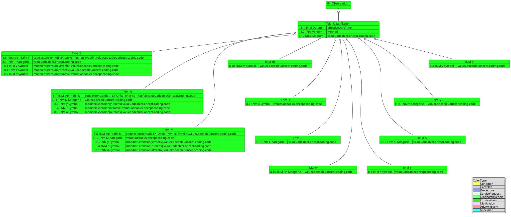
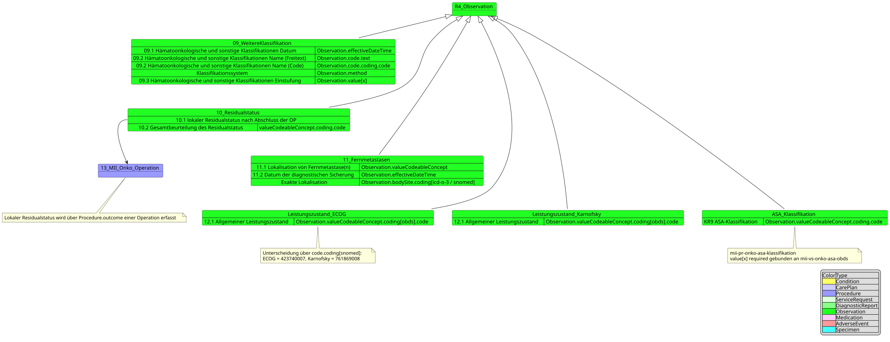
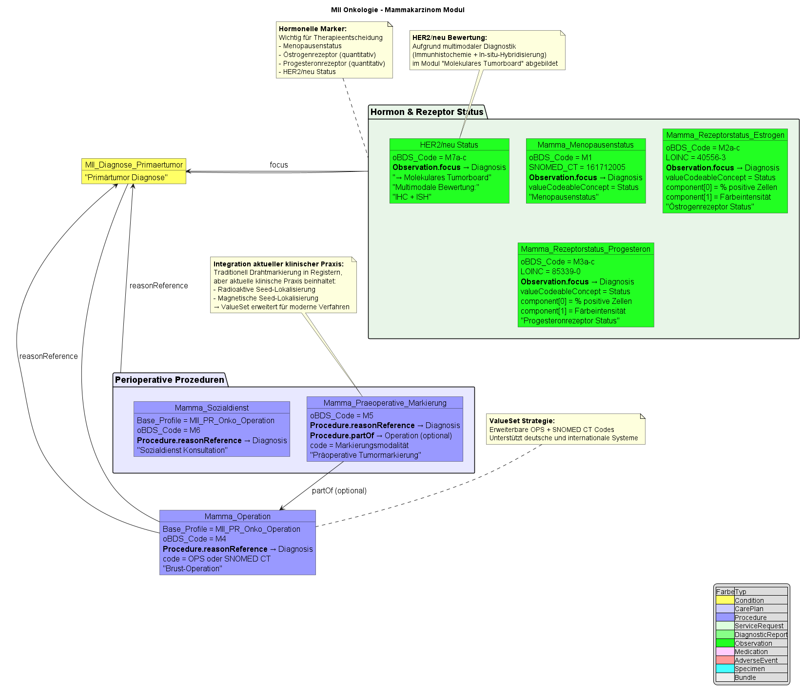

# Profile - MII IG Kerndatensatz-Modul Onkologie v2026.0.3

* [**Inhaltsverzeichnis**](toc.md)
* **Profile**

## Profile

Die vollständige, automatisch generierte Liste aller Profile dieses Moduls findet sich auf der [Artefakt-Übersicht](artifacts.md); die fachliche Dokumentation jedes Profils steht als Einleitung direkt auf der jeweiligen Profilseite. Diese Seite gibt den Überblick: die Standards-Basis, die vereinfachten Strukturdarstellungen je oBDS-Kapitel und die organspezifischen Module.

### Standards-Basis

Die Arbeiten der Kerndatensatz-Spezifikationen basieren, falls möglich, auf internationalen Standards und Terminologien — hervorzuheben ist die [International Patient Summary](http://hl7.org/fhir/uv/ips/history.html). Eine Anpassung an die Gegebenheiten des deutschen Gesundheitswesens erfolgt durch die Verwendung der [Deutschen FHIR-Basisprofile](https://simplifier.net/basisprofil-de-r4) von HL7 Deutschland; außerdem wird Kompatibilität zu den FHIR-Spezifikationen der Kassenärztlichen Bundesvereinigung (KBV) angestrebt.

### Vereinfachte Profildarstellungen (Vererbung und oBDS-Mapping)

Im Folgenden werden die Profile in vereinfachter Version dargestellt. Diese Darstellung legt besonderen Wert auf die Vererbung von anderen Profilen und das Mapping der oBDS-Datenfelder auf die entsprechenden FHIR-Elemente.

#### Diagnose

Die Diagnose enthält sowohl Informationen zur Primärdiagnose selbst als auch zur Histologie und Lokalisation des Primärtumors.

#### Histologie

#### TNM-Klassifikation

#### Weitere Klassifikationen, Residualstatus, Allgemeiner Leistungszustand, Fernmetastasen

#### Prozeduren, Medikation und Nebenwirkungen

#### Verlauf, Tumorkonferenz, Tod und Genetische Variante

### Lymphknotenuntersuchungen

Vier Profile beschreiben die Lymphknotenuntersuchungen im Rahmen des onkologischen Stagings. Das oBDS sieht vier unterschiedliche Datenpunkte vor:

* [Anzahl der untersuchten Lymphknoten](StructureDefinition-mii-pr-onko-anzahl-untersuchte-lymphknoten.md)
* [Anzahl der befallenen Lymphknoten](StructureDefinition-mii-pr-onko-anzahl-befallene-lymphknoten.md)
* [Anzahl der untersuchten Sentinel-Lymphknoten](StructureDefinition-mii-pr-onko-anzahl-untersuchte-sentinel-lymphknoten.md)
* [Anzahl der befallenen Sentinel-Lymphknoten](StructureDefinition-mii-pr-onko-anzahl-befallene-sentinel-lymphknoten.md)

Das Verhältnis zwischen befallenen und untersuchten Lymphknoten wird teilweise im klinischen Alltag bestimmt, ist im oBDS aber nicht als eigener Datenpunkt vorgesehen.

### Organspezifische Module

Die organspezifischen Module erweitern das Basismodul um **entitätsspezifische Datenelemente** gemäß den Anforderungen der ADT/GEKID-Basisdokumentation. Sie adressieren die besonderen diagnostischen und therapeutischen Aspekte einzelner Tumorentitäten.

#### Mamma

Das Mamma-Modul implementiert die organspezifischen Profile für Mammakarzinom-relevante Daten gemäß [oBDS-Modul Mammakarzinom](https://www.basisdatensatz.de/module/5/mammakarzinom): Rezeptorstatus-Bestimmungen (Estrogen/Progesteron mit Färbeintensität und Anteil positiver Zellen), Menopausenstatus, präoperative Markierungsmodalitäten, intraoperatives Imaging und Mamma-spezifische Operationsverfahren. Der Her2Neu-Status ist derzeit im Molecular-Tumorboard- Profil abgebildet; die Tumorgröße wurde in das Histologie-Kapitel verschoben, da sie auf multiple Entitäten anwendbar ist.

#### Prostata

Das Prostata-Modul umfasst PSA-Werte als zentralen Tumormarker, Gleason-Scoring (primäre, sekundäre und tertiäre Patterns), Grade Groups (1–5), Biopsie-Ergebnisse (Anzahl Stanzen, Karzinom-Befall) und postoperative Komplikationen nach Clavien-Dindo.

#### Kolorektales Karzinom (KRK)

Das KRK-Modul umfasst die präoperative Beurteilung (Abstand zur Anokutanlinie, MRT-basierte Messung der mesorektalen Faszie, ASA-Klassifikation), KRK-spezifische Operationsverfahren und Stoma-Markierung, Resektionsränder (aboral und zirkumferentiell/CRM), die Anastomoseninsuffizienz-Graduierung und spezifische Specimen-Profile für KRK-Resektate.

#### Malignes Melanom

Die Melanom-Profile umfassen die Breslow-Tiefe (LOINC 39092-1) als wichtigsten prognostischen Faktor, die Ulzeration des Primärtumors (SNOMED CT 385324008), den Sicherheitsabstand der Exzision, die LDH als prognostischen Marker und Melanom-spezifische Exzisionsverfahren.

