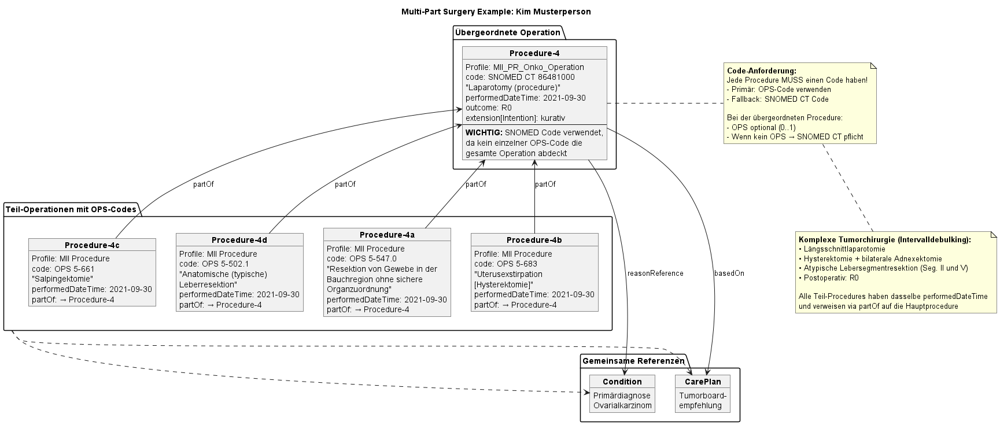

# MII PR Onkologie Operation - MII IG Kerndatensatz-Modul Onkologie v2026.0.3

* [**Table of Contents**](toc.md)
* [**Artifacts Summary**](artifacts.md)
* **MII PR Onkologie Operation**

## Resource Profile: MII PR Onkologie Operation 

| | |
| :--- | :--- |
| *Official URL*:https://www.medizininformatik-initiative.de/fhir/ext/modul-onko/StructureDefinition/mii-pr-onko-operation | *Version*:2026.0.3 |
| Active as of 2026-08-27 | *Computable Name*:MII_PR_Onko_Operation |

 
Operation nach OPS inklusive Intention, Datum und Komplikationen: 

This profile describes an operation in oncology.

* The operation profile for oncology is derived from the MII procedure module and additionally specified for oBDS content. https://simplifier.net/guide/mii-ig-modul-prozedur-2024-de/MIIIGModulProzedur/TechnischeImplementierung/FHIRProfile/Prozedur-Procedure.page.md?version=current

### Category and code

* The MII procedure recommends mapping the category using the OPS main categories transferred into SNOMED (https://www.medizininformatik-initiative.de/fhir/core/modul-prozedur/ValueSet/procedures-category-sct), where the SNOMED code `38771300` corresponds to OPS category "5 - Operations". However, according to oBDS, in justified cases a different coding (e.g. `103693007` for "1 - Diagnostic measures") may also be entered here. For this reason, the category is not further restricted.
* The exact type of procedure is coded in the `Procedure.code` field. **IMPORTANT**: Every Procedure MUST have a code - either OPS or SNOMED CT.
* Primarily an OPS code SHOULD be used. If no matching OPS code exists, a SNOMED CT code MUST be chosen.
* At most one OPS value SHOULD be coded per Procedure resource. Additional procedures are represented as individual Procedure resources.
* Note: Within the KDS module Oncology, the overarching MII procedure is also used to represent radiotherapy and systemic/watchful-waiting therapy. For the special aspects regarding categories and codes - see [Radiotherapy: Procedure](StructureDefinition-mii-pr-onko-strahlentherapie.md) and [Systemic Therapy: Procedure](StructureDefinition-mii-pr-onko-systemische-therapie.md).

### Multi-part procedures and related operations

In complex oncological procedures, several surgical procedures are often performed in one session. Since only one OPS code should be coded per Procedure resource, two modeling approaches are supported:

#### Approach 1: Parent Procedure with general code

**IMPORTANT**: A Procedure MUST have either an OPS code OR a SNOMED CT code. If no matching OPS code exists for the parent Procedure, a suitable SNOMED CT code MUST be chosen.

1. **Parent Procedure**: A main Procedure with a general SNOMED CT code for the location/type of the procedure
* `Procedure.code`: SNOMED CT code (e.g. 86481000 "Laparotomy (procedure)")
* `Procedure.code.coding[ops]`: Remains empty, since no specific OPS code exists
* This Procedure SHOULD conform to the MII_PR_Onko_Operation profile
* **Note**: The SNOMED CT code must be chosen from available SNOMED CT concepts

1. **Detailed sub-Procedures**: Individual Procedure resources for each specific OPS code
* Linked via `Procedure.partOf` to the parent Procedure
* Each with its specific OPS code

**Example:**

```
Procedure/haupteingriff (SNOMED: 176282005 "Resektion des Rektums")
├── Procedure/teileingriff1 (partOf → haupteingriff)
│   └── OPS: 5-484.35 "Rektumresektion mit Anastomose"
└── Procedure/teileingriff2 (partOf → haupteingriff)
    └── OPS: 5-469.21 "Andere Operationen am Darm"

```

#### Approach 2: Procedures of equal standing

For complex tumor operations where the hierarchy is not clear:

1. **All Procedures of equal standing**: Each Procedure represents one OPS code
1. **Common parent Procedure optional**: Can serve as a grouping
1. **Alternative**: Choose one of the Procedures as the "main Procedure" (the decision may be arbitrary)

**Note on harmonization**: The decision as to which Procedure counts as the "main Procedure" can be difficult in complex tumor operations and can hardly be harmonized post hoc.

#### Common aspects for multi-part procedures:

* **Timing**: All linked procedures should have the same `performedDateTime` if they were performed in one session
* **Intent**: The extension for the operation intent should be consistent across all linked procedures
* **Complications**: Can be documented on the affected individual procedure or on the parent Procedure
* **Residual status**: The local residual status is documented on the resecting procedure
* **References**: All Procedures should reference the same primary diagnosis (`reasonReference`) and, if applicable, a tumor board recommendation (`basedOn`)

#### Visualization using the example of Kim Musterperson



### Extensions

#### Intent

The MII procedure module already has an extension [Intent of the procedure](https://www.medizininformatik-initiative.de/fhir/core/modul-prozedur/StructureDefinition/Durchfuehrungsabsicht) with a binding to SNOMED CT codes. However, since the intent of the operation is captured in oBDS via an oBDS-specific answer set, the procedure was extended with an additional element "Intent". Existing extensions of the MII procedure module are optional and not directly relevant for the mapping from oBDS.

Further information: [Extension Intent (Operation)](StructureDefinition-mii-ex-onko-operation-intention.md)

#### Urgency (type of procedure)

The "Urgency" extension captures the modality of procedure performance. This data point originally comes from the organ-specific module Colorectal Carcinoma (KRK 6 oBDS 2021), but is **universally applicable to all Procedures** and was therefore integrated into the general Operation profile.

The extension distinguishes between:

* **E**: Elective procedure (planned procedure)
* **N**: Emergency procedure
* **U**: Unknown

This extension is particularly relevant for quality assurance and statistical evaluations, since emergency procedures often show different outcomes and complication rates than planned procedures. Although originally defined for colorectal procedures, the distinction between elective and emergency procedures is clinically relevant for all surgical procedures.

**Usage:**

```
* extension[urgency].valueCodeableConcept = $mii-cs-onko-operation-urgency#E "Elektiveingriff"

```

Further information: [Extension Urgency (type of procedure)](StructureDefinition-mii-ex-onko-operation-urgency.md)

### Residual status and further observations

The oBDS provides for capturing the R status when tumor tissue is resected. Depending on the procedure performed, the assessment of residual status should be made either **locally** or **globally**. These are captured in oBDS as two different data points. In the present FHIR profiling, the local residual status (where applicable) is coded under Procedure.outcome. The global residual status is captured via a separate Observation (see Residual status: Observation).

In addition to the residual status, there are further data points that can reference an operation and are reported in oBDS together with it. These include the histological examinations (lymph nodes, grading) as well as ICD-O morphology, TNM and/or other classifications where applicable.

-------

#### References to other profiles

An operation captured and reported as part of the cancer registry is often based on a therapy recommendation from a tumor board. In this case, a link between the elements should be established via `Procedure.basedOn(Reference(CarePlan))`. Furthermore, the operation references the primary diagnosis via `Procedure.reasonReference`.

-------

### Conformance

This profiling is compatible with the procedure profile of the ISiK basic modules level 4. https://simplifier.net/isik-basis-v4/isikprozedur

-------

Mapping dataset to FHIR

> The mapping of the dataset fields is documented in the logical model: [MII LM Onkologie](StructureDefinition-mii-lm-onko.md).

-------

Mapping [Uniform Oncological Basic Dataset (oBDS)](https://basisdatensatz.de/basisdatensatz) to FHIR

> The oBDS mappings are recorded in the artefact view of this profile: [MII PR Onkologie Operation](StructureDefinition-mii-pr-onko-operation.md).

-------

**Search parameters**

The following search parameters are relevant for the Oncology module, including in combination:

1. The search parameter "_id" MUST be supported:Examples:`GET [base]/Procedure?_id=103270`Usage notes: Further information on searching by "_id" can be found in the [FHIR base specification - section "Parameters for all resources"](http://hl7.org/fhir/R4/search.html#all).
1. The search parameter "_profile" MUST be supported:Examples:`GET [base]/Procedure?_profile=https://www.medizininformatik-initiative.de/fhir/core/modul-prozedur/StructureDefinition/Procedure`Usage notes: Further information on searching by "_profile" can be found in the [FHIR base specification - section "Parameters for all resources"](http://hl7.org/fhir/R4/search.html#all).
1. The search parameter "status" MUST be supported:Examples:`GET [base]/Procedure?status=completed`Usage notes: Further information on searching by "Procedure.status" can be found in the [FHIR base specification - section "Token Search"](http://hl7.org/fhir/R4/search.html#token).
1. The search parameter "category" MUST be supported:Examples:`GET [base]/Procedure?category=http://snomed.info/sct|103693007`Usage notes: Further information on searching by "Procedure.category" can be found in the [FHIR base specification - section "Token Search"](http://hl7.org/fhir/R4/search.html#token).
1. The search parameter "code" MUST be supported:Examples:`GET [base]/Procedure?code=http://fhir.de/CodeSystem/bfarm/ops|5-37`Usage notes: Further information on searching by "Procedure.code" can be found in the [FHIR base specification - section "Token Search"](http://hl7.org/fhir/R4/search.html#token).
1. The search parameter "date" MUST be supported:Examples:`GET [base]/Procedure?date=2022-01-01`Usage notes: Further information on searching by "Procedure.performed" can be found in the [FHIR base specification - section "Date Search"](http://hl7.org/fhir/R4/search.html#date).
1. The search parameter "subject" MUST be supported:Examples:`GET [base]/Procedure?subject=Patient/test`Usage notes: Further information on searching by "Procedure.subject" can be found in the [FHIR base specification - section "reference"](http://hl7.org/fhir/R4/search.html#reference).
1. The search parameter "patient" MUST be supported:Examples:`GET [base]/Procedure?patient=Patient/test`Usage notes: Further information on searching by "Procedure.subject" can be found in the [FHIR base specification - section "reference"](http://hl7.org/fhir/R4/search.html#reference).
1. The search parameter "bodySite" MUST be supported:Examples:`GET [base]/Procedure?bodySite=http://snomed.info/sct|80891009`Usage notes: Further information on searching by "Procedure.bodySite" can be found in the [FHIR base specification - section "Token Search"](http://hl7.org/fhir/R4/search.html#token).
1. The search parameter "dokumentationsdatum" MUST be supported:Examples:`GET [base]/Procedure?dokumentationsdatum=2022-01-01`Usage notes: Further information on searching by "Procedure.extension:Dokumentationsdatum" can be found in the [FHIR base specification - section "Date Search"](http://hl7.org/fhir/R4/search.html#date).
1. The search parameter "durchfuehrungsabsicht" MUST be supported:Examples:`GET [base]/Procedure?durchfuehrungsabsicht=http://snomed.info/sct|262202000`Usage notes: Further information on searching by "Procedure.extension:Durchfuehrungsabsicht" can be found in the [FHIR base specification - section "Token Search"](http://hl7.org/fhir/R4/search.html#token).
1. The search parameter "outcome" MUST be supported:Examples:`GET [base]/Procedure?outcome=https://www.medizininformatik-initiative.de/fhir/ext/modul-onko/CodeSystem/mii-cs-onko-residualstatus|R1`Usage notes: Further information on searching by "Procedure.extension:Durchfuehrungsabsicht" can be found in the [FHIR base specification - section "Token Search"](http://hl7.org/fhir/R4/search.html#token).
1. The search parameter "extension-intention" MUST be supported:Examples:`GET [base]/Procedure?extension-intention=https://www.medizininformatik-initiative.de/fhir/ext/modul-onko/CodeSystem/mii-cs-onko-intention|K`Usage notes: Further information on searching by "Procedure.extension:Durchfuehrungsabsicht" can be found in the [FHIR base specification - section "Token Search"](http://hl7.org/fhir/R4/search.html#token).

**Examples**

[mii-exa-onko-operation-1](Procedure-mii-exa-onko-operation-1.md)

**Usages:**

* Derived from this Profile: [MII PR Onkologie Präoperative Drahtmarkierung Mamma](StructureDefinition-mii-pr-onko-krk-operation.md), [MII PR Onkologie Mamma Operation](StructureDefinition-mii-pr-onko-mamma-operation.md), [MII PR Onkologie Präoperative Drahtmarkierung Mamma](StructureDefinition-mii-pr-onko-mamma-sozialdienst.md), [MII PR Onko Melanom Exzision](StructureDefinition-mii-pr-onko-melanom-exzision.md) and [MII PR Onko Prostata Operation](StructureDefinition-mii-pr-onko-prostata-operation.md)
* Refer to this Profile: [MII PR Onkologie Präoperative Drahtmarkierung Mamma](StructureDefinition-mii-pr-onko-krk-operation.md), [MII PR Onkologie Mamma Operation](StructureDefinition-mii-pr-onko-mamma-operation.md), [MII PR Onkologie Präoperative Markierung Mamma](StructureDefinition-mii-pr-onko-mamma-praeoperative-markierung.md) and [MII PR Onkologie Clavien Dindo](StructureDefinition-mii-pr-onko-prostate-clavien-dindo.md)
* Examples for this Profile: [Procedure/PatientKimMusterperson-Procedure-4](Procedure-PatientKimMusterperson-Procedure-4.md), [Procedure/mii-exa-onko-operation-1](Procedure-mii-exa-onko-operation-1.md), [Procedure/mii-exa-onko-prostata-surgery-1](Procedure-mii-exa-onko-prostata-surgery-1.md), [Procedure/mii-exa-onko-prostata-surgery-2](Procedure-mii-exa-onko-prostata-surgery-2.md)... Show 5 more, [Procedure/mii-exa-onko-right-hemicolectomy](Procedure-mii-exa-onko-right-hemicolectomy.md), [Procedure/mii-exa-onko-sigmoid-resection-part1](Procedure-mii-exa-onko-sigmoid-resection-part1.md), [Procedure/mii-exa-onko-sigmoid-resection-part2](Procedure-mii-exa-onko-sigmoid-resection-part2.md), [Procedure/mii-exa-onko-sigmoid-resection-part3](Procedure-mii-exa-onko-sigmoid-resection-part3.md) and [Procedure/mii-exa-onko-sigmoid-resection](Procedure-mii-exa-onko-sigmoid-resection.md)
* CapabilityStatements using this Profile: [MII CPS Onkology CapabilityStatement](CapabilityStatement-mii-cps-onko-capabilitystatement.md)

You can also check for [usages in the FHIR IG Statistics](https://packages2.fhir.org/xig/resource/de.medizininformatikinitiative.kerndatensatz.onkologie|current/StructureDefinition/StructureDefinition-mii-pr-onko-operation.json)

### Formal Views of Profile Content

 [Description of Profiles, Differentials, Snapshots, and their representations](http://build.fhir.org/ig/FHIR/ig-guidance/readingIgs.html#structure-definitions). 

 

Other representations of profile: [CSV](../StructureDefinition-mii-pr-onko-operation.csv), [Excel](../StructureDefinition-mii-pr-onko-operation.xlsx), [Schematron](../StructureDefinition-mii-pr-onko-operation.sch) 


## Resource Content

```json
{
  "resourceType" : "StructureDefinition",
  "id" : "mii-pr-onko-operation",
  "extension" : [{
    "url" : "https://www.medizininformatik-initiative.de/fhir/modul-meta/StructureDefinition/mii-ex-meta-license-codeable",
    "valueCodeableConcept" : {
      "coding" : [{
        "system" : "http://hl7.org/fhir/spdx-license",
        "code" : "CC-BY-4.0",
        "display" : "Creative Commons Attribution 4.0 International"
      }]
    }
  }],
  "url" : "https://www.medizininformatik-initiative.de/fhir/ext/modul-onko/StructureDefinition/mii-pr-onko-operation",
  "version" : "2026.0.3",
  "name" : "MII_PR_Onko_Operation",
  "title" : "MII PR Onkologie Operation",
  "status" : "active",
  "date" : "2026-08-27T15:31:43+00:00",
  "publisher" : "Medizininformatik Initiative",
  "contact" : [{
    "name" : "Medizininformatik Initiative",
    "telecom" : [{
      "system" : "url",
      "value" : "https://www.medizininformatik-initiative.de/"
    }]
  }],
  "description" : "Operation nach OPS inklusive Intention, Datum und Komplikationen:",
  "jurisdiction" : [{
    "coding" : [{
      "system" : "urn:iso:std:iso:3166",
      "code" : "DE",
      "display" : "Germany"
    }]
  }],
  "fhirVersion" : "4.0.1",
  "mapping" : [{
    "identity" : "oBDS",
    "name" : "Mapping FHIR zu oBDS"
  }],
  "kind" : "resource",
  "abstract" : false,
  "type" : "Procedure",
  "baseDefinition" : "https://www.medizininformatik-initiative.de/fhir/core/modul-prozedur/StructureDefinition/Procedure",
  "derivation" : "constraint",
  "differential" : {
    "element" : [{
      "id" : "Procedure",
      "path" : "Procedure",
      "mapping" : [{
        "identity" : "oBDS",
        "map" : "13",
        "comment" : "Operation"
      }]
    },
    {
      "id" : "Procedure.extension",
      "path" : "Procedure.extension",
      "min" : 1
    },
    {
      "id" : "Procedure.extension:Intention",
      "path" : "Procedure.extension",
      "sliceName" : "Intention",
      "short" : "Intention der OP",
      "_short" : {
        "extension" : [{
          "extension" : [{
            "url" : "lang",
            "valueCode" : "de-DE"
          },
          {
            "url" : "content",
            "valueString" : "Intention der OP"
          }],
          "url" : "http://hl7.org/fhir/StructureDefinition/translation"
        }]
      },
      "definition" : "Intention der OP gemäß 13.1 oBDS 2021",
      "_definition" : {
        "extension" : [{
          "extension" : [{
            "url" : "lang",
            "valueCode" : "de-DE"
          },
          {
            "url" : "content",
            "valueString" : "Intention der OP gemäß 13.1 oBDS 2021"
          }],
          "url" : "http://hl7.org/fhir/StructureDefinition/translation"
        }]
      },
      "min" : 1,
      "max" : "1",
      "type" : [{
        "code" : "Extension",
        "profile" : ["https://www.medizininformatik-initiative.de/fhir/ext/modul-onko/StructureDefinition/mii-ex-onko-operation-intention"]
      }],
      "mustSupport" : true
    },
    {
      "id" : "Procedure.extension:Intention.value[x].coding.code",
      "path" : "Procedure.extension.value[x].coding.code",
      "mapping" : [{
        "identity" : "oBDS",
        "map" : "13.1",
        "comment" : "Intention der Operation"
      }]
    },
    {
      "id" : "Procedure.extension:Urgency",
      "path" : "Procedure.extension",
      "sliceName" : "Urgency",
      "short" : "Art des Eingriffs",
      "_short" : {
        "extension" : [{
          "extension" : [{
            "url" : "lang",
            "valueCode" : "de-DE"
          },
          {
            "url" : "content",
            "valueString" : "Art des Eingriffs"
          }],
          "url" : "http://hl7.org/fhir/StructureDefinition/translation"
        }]
      },
      "definition" : "Modalität der Eingriffsdurchführung gemäß KR6 oBDS 2021",
      "_definition" : {
        "extension" : [{
          "extension" : [{
            "url" : "lang",
            "valueCode" : "de-DE"
          },
          {
            "url" : "content",
            "valueString" : "Modalität der Eingriffsdurchführung - Elektiveingriff vs. Notfalleingriff - gemäß KR6 oBDS 2021"
          }],
          "url" : "http://hl7.org/fhir/StructureDefinition/translation"
        }]
      },
      "min" : 0,
      "max" : "1",
      "type" : [{
        "code" : "Extension",
        "profile" : ["https://www.medizininformatik-initiative.de/fhir/ext/modul-onko/StructureDefinition/mii-ex-onko-operation-urgency"]
      }],
      "mustSupport" : true
    },
    {
      "id" : "Procedure.extension:Urgency.value[x].coding.code",
      "path" : "Procedure.extension.value[x].coding.code",
      "mapping" : [{
        "identity" : "oBDS",
        "map" : "KR6",
        "comment" : "Art des Eingriffs (Modalität der Eingriffsdurchführung)"
      }]
    },
    {
      "id" : "Procedure.basedOn",
      "path" : "Procedure.basedOn",
      "type" : [{
        "code" : "Reference",
        "targetProfile" : ["http://hl7.org/fhir/StructureDefinition/CarePlan"]
      }],
      "mustSupport" : true
    },
    {
      "id" : "Procedure.partOf",
      "path" : "Procedure.partOf",
      "type" : [{
        "code" : "Reference",
        "targetProfile" : ["http://hl7.org/fhir/StructureDefinition/Observation",
        "http://hl7.org/fhir/StructureDefinition/Procedure"]
      }],
      "mustSupport" : true
    },
    {
      "id" : "Procedure.code.coding:ops",
      "path" : "Procedure.code.coding",
      "sliceName" : "ops",
      "short" : "OPS-Kode der Operation",
      "_short" : {
        "extension" : [{
          "extension" : [{
            "url" : "lang",
            "valueCode" : "de-DE"
          },
          {
            "url" : "content",
            "valueString" : "OPS-Kode der Operation"
          }],
          "url" : "http://hl7.org/fhir/StructureDefinition/translation"
        },
        {
          "extension" : [{
            "url" : "lang",
            "valueCode" : "en-US"
          },
          {
            "url" : "content",
            "valueString" : "OPS code"
          }],
          "url" : "http://hl7.org/fhir/StructureDefinition/translation"
        }]
      },
      "definition" : "OPS-Kode der Operation gemäß 13.3 oBDS 2021",
      "_definition" : {
        "extension" : [{
          "extension" : [{
            "url" : "lang",
            "valueCode" : "de-DE"
          },
          {
            "url" : "content",
            "valueString" : "OPS-Kode der Operation gemäß 13.3 oBDS 2021"
          }],
          "url" : "http://hl7.org/fhir/StructureDefinition/translation"
        },
        {
          "extension" : [{
            "url" : "lang",
            "valueCode" : "en-US"
          },
          {
            "url" : "content",
            "valueString" : "A reference to a code defined by the German Procedure Classification OPS"
          }],
          "url" : "http://hl7.org/fhir/StructureDefinition/translation"
        }]
      }
    },
    {
      "id" : "Procedure.code.coding:ops.version",
      "path" : "Procedure.code.coding.version",
      "mapping" : [{
        "identity" : "oBDS",
        "map" : "13.4",
        "comment" : "OPS Version"
      }]
    },
    {
      "id" : "Procedure.code.coding:ops.code",
      "path" : "Procedure.code.coding.code",
      "mapping" : [{
        "identity" : "oBDS",
        "map" : "13.3",
        "comment" : "OPS"
      }]
    },
    {
      "id" : "Procedure.subject",
      "path" : "Procedure.subject",
      "type" : [{
        "code" : "Reference",
        "targetProfile" : ["http://hl7.org/fhir/StructureDefinition/Patient"]
      }]
    },
    {
      "id" : "Procedure.performed[x]",
      "path" : "Procedure.performed[x]",
      "type" : [{
        "code" : "dateTime"
      }]
    },
    {
      "id" : "Procedure.performed[x]:performedDateTime",
      "path" : "Procedure.performed[x]",
      "sliceName" : "performedDateTime",
      "type" : [{
        "code" : "dateTime"
      }],
      "mapping" : [{
        "identity" : "oBDS",
        "map" : "13.2",
        "comment" : "OP Datum"
      }]
    },
    {
      "id" : "Procedure.reasonReference",
      "path" : "Procedure.reasonReference",
      "type" : [{
        "code" : "Reference",
        "targetProfile" : ["https://www.medizininformatik-initiative.de/fhir/ext/modul-onko/StructureDefinition/mii-pr-onko-diagnose-primaertumor",
        "http://hl7.org/fhir/StructureDefinition/Condition"]
      }],
      "mustSupport" : true
    },
    {
      "id" : "Procedure.outcome",
      "path" : "Procedure.outcome",
      "mustSupport" : true,
      "binding" : {
        "strength" : "required",
        "valueSet" : "https://www.medizininformatik-initiative.de/fhir/ext/modul-onko/ValueSet/mii-vs-onko-beurteilung-lokaler-residualstatus"
      },
      "mapping" : [{
        "identity" : "oBDS",
        "map" : "10.1",
        "comment" : "Beurteilung des lokalen Residualstatus nach Abschluss der Operation"
      }]
    },
    {
      "id" : "Procedure.outcome.coding",
      "path" : "Procedure.outcome.coding",
      "short" : "Lokaler Residualstatus",
      "_short" : {
        "extension" : [{
          "extension" : [{
            "url" : "lang",
            "valueCode" : "de-DE"
          },
          {
            "url" : "content",
            "valueString" : "Lokaler Residualstatus"
          }],
          "url" : "http://hl7.org/fhir/StructureDefinition/translation"
        }]
      },
      "definition" : "Lokaler Residualstatus der OP gemäß 10.1 oBDS 2021. Globaler Residualstatus wird prozedurenunabhängig als eigenständige Observation kodiert.",
      "_definition" : {
        "extension" : [{
          "extension" : [{
            "url" : "lang",
            "valueCode" : "de-DE"
          },
          {
            "url" : "content",
            "valueString" : "Lokaler Residualstatus der OP gemäß 10.1 oBDS 2021. Globaler Residualstatus wird prozedurenunabhängig als eigenständige Observation kodiert."
          }],
          "url" : "http://hl7.org/fhir/StructureDefinition/translation"
        }]
      }
    },
    {
      "id" : "Procedure.outcome.coding.system",
      "path" : "Procedure.outcome.coding.system",
      "patternUri" : "https://www.medizininformatik-initiative.de/fhir/ext/modul-onko/CodeSystem/mii-cs-onko-residualstatus",
      "mustSupport" : true
    },
    {
      "id" : "Procedure.outcome.coding.code",
      "path" : "Procedure.outcome.coding.code",
      "mustSupport" : true
    },
    {
      "id" : "Procedure.complication",
      "path" : "Procedure.complication",
      "slicing" : {
        "discriminator" : [{
          "type" : "pattern",
          "path" : "$this"
        }],
        "rules" : "open"
      },
      "mustSupport" : true,
      "mapping" : [{
        "identity" : "oBDS",
        "map" : "13.5",
        "comment" : "OP Komplikationen "
      }]
    },
    {
      "id" : "Procedure.complication:compl_obds",
      "path" : "Procedure.complication",
      "sliceName" : "compl_obds",
      "min" : 0,
      "max" : "*",
      "mustSupport" : true,
      "binding" : {
        "strength" : "required",
        "valueSet" : "https://www.medizininformatik-initiative.de/fhir/ext/modul-onko/ValueSet/mii-vs-onko-operation-komplikation"
      }
    },
    {
      "id" : "Procedure.complication:compl_obds.coding",
      "path" : "Procedure.complication.coding",
      "short" : "Komplikation der OP laut oBDS",
      "_short" : {
        "extension" : [{
          "extension" : [{
            "url" : "lang",
            "valueCode" : "de-DE"
          },
          {
            "url" : "content",
            "valueString" : "Komplikation der OP laut oBDS"
          }],
          "url" : "http://hl7.org/fhir/StructureDefinition/translation"
        }]
      },
      "definition" : "Komplikation der OP gemäß 13.5 oBDS 2021",
      "_definition" : {
        "extension" : [{
          "extension" : [{
            "url" : "lang",
            "valueCode" : "de-DE"
          },
          {
            "url" : "content",
            "valueString" : "Komplikation der OP gemäß 13.5 oBDS 2021"
          }],
          "url" : "http://hl7.org/fhir/StructureDefinition/translation"
        }]
      }
    },
    {
      "id" : "Procedure.complication:compl_obds.coding.system",
      "path" : "Procedure.complication.coding.system",
      "patternUri" : "https://www.medizininformatik-initiative.de/fhir/ext/modul-onko/CodeSystem/mii-cs-onko-operation-komplikation"
    },
    {
      "id" : "Procedure.complication:compl_obds.coding.code",
      "path" : "Procedure.complication.coding.code",
      "min" : 1,
      "mustSupport" : true
    },
    {
      "id" : "Procedure.complication:compl_icd10",
      "path" : "Procedure.complication",
      "sliceName" : "compl_icd10",
      "min" : 0,
      "max" : "*",
      "mustSupport" : true,
      "binding" : {
        "strength" : "required",
        "valueSet" : "http://fhir.de/ValueSet/bfarm/icd-10-gm"
      }
    },
    {
      "id" : "Procedure.complication:compl_icd10.coding",
      "path" : "Procedure.complication.coding",
      "short" : "Komplikation der OP Sonstige ICD-10",
      "_short" : {
        "extension" : [{
          "extension" : [{
            "url" : "lang",
            "valueCode" : "de-DE"
          },
          {
            "url" : "content",
            "valueString" : "Komplikation der OP Sonstige ICD-10"
          }],
          "url" : "http://hl7.org/fhir/StructureDefinition/translation"
        }]
      },
      "definition" : "Komplikation der OP - soweit nicht in 13.1 oBDS 2021 enthalten - als ICD-10-GM",
      "_definition" : {
        "extension" : [{
          "extension" : [{
            "url" : "lang",
            "valueCode" : "de-DE"
          },
          {
            "url" : "content",
            "valueString" : "Komplikation der OP - soweit nicht in 13.1 oBDS 2021 enthalten - als ICD-10-GM"
          }],
          "url" : "http://hl7.org/fhir/StructureDefinition/translation"
        }]
      }
    },
    {
      "id" : "Procedure.complication:compl_icd10.coding.system",
      "path" : "Procedure.complication.coding.system",
      "min" : 1,
      "patternUri" : "http://fhir.de/CodeSystem/bfarm/icd-10-gm"
    },
    {
      "id" : "Procedure.complication:compl_icd10.coding.code",
      "path" : "Procedure.complication.coding.code",
      "min" : 1
    }]
  }
}

```
