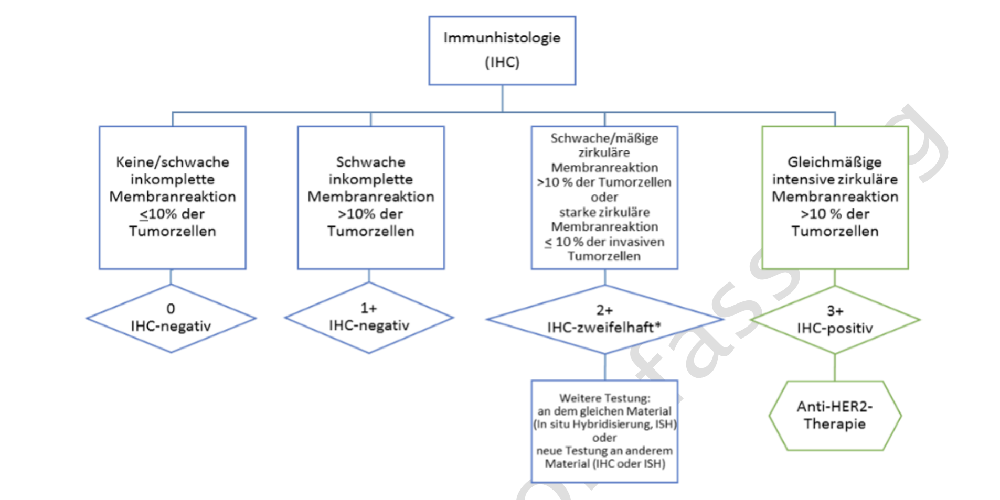

# MII PR Onkologie Her2neu Status - MII IG Kerndatensatz-Modul Onkologie v2027.0.0-ballot.rc1

* [**Table of Contents**](toc.md)
* [**Artifacts Summary**](artifacts.md)
* **MII PR Onkologie Her2neu Status**

## Resource Profile: MII PR Onkologie Her2neu Status 

| | |
| :--- | :--- |
| *Official URL*:https://www.medizininformatik-initiative.de/fhir/ext/modul-onko/StructureDefinition/mii-pr-onko-mamma-her2neu-status | *Version*:2027.0.0-ballot.rc1 |
| Active as of 2026-09-03 | *Computable Name*:MII_PR_Onko_Mamma_Her2neu_Status |

 
Dieses Profil beschreibt den Her2neu Status einer pathologisch untersuchten Probe beim Mamma-Karzinom in der Onkologie 

### Content

The **HER2/neu Status Profile** documents the diagnostic HER2/neu status of a pathologically examined specimen in breast cancer. HER2/neu (also HER2 or ERBB2) is an important prognostic and predictive biomarker that determines eligibility for anti-HER2-targeted therapy.

The HER2/neu status is based on **immunohistochemical (IHC) staining** and, for certain findings, additionally on **in situ hybridization (ISH, e.g. FISH or CISH)**. Determination follows the ASCO/CAP guidelines and the requirements of the S3 guideline on breast cancer.

-------

### Clinical background

HER2/neu determination is essential for therapy planning in breast cancer:

* **HER2-positive tumors** (approx. 15-20% of breast cancers) benefit from anti-HER2 therapies such as trastuzumab, pertuzumab or T-DM1
* **HER2-low tumors** show low HER2 expression and may benefit from newer therapies such as trastuzumab deruxtecan (based on the DESTINY-Breast04/06 trials)
* **HER2-negative tumors** do not receive anti-HER2-targeted therapy

-------

### HER2/neu determination according to ASCO/CAP

HER2/neu determination is a multi-step process:


**Figure 1**: HER2/neu determination algorithm according to ASCO/CAP guidelines. The initial IHC staining leads to ISH testing for 2+ findings.



**Figure 2**: Interpretation of HER2/neu results and classification into HER2-positive, HER2-low, HER2-ultralow and HER2-negative.

#### IHC scores:

* **3+**: Strong, complete membrane staining in >10% of tumor cells → HER2-positive
* **2+**: Weak to moderate, complete membrane staining in >10% of tumor cells → ISH testing required
* **1+**: Weak, incomplete membrane staining in >10% of tumor cells → HER2-low (if ISH-negative or without ISH)
* **0**: No staining or membrane staining in ≤10% of tumor cells

#### ISH testing (FISH, CISH, etc.):

* **Positive**: HER2/CEP17 ratio ≥2.0 or HER2 copy number ≥6.0 per cell
* **Negative**: HER2/CEP17 ratio <2.0 and HER2 copy number <4.0 per cell
* **Equivocal**: Borderline findings that require retesting

## The Molecular Tumor Board module offers more fine-grained profiles for representing the IHC and ISH data points within a molecular pathology findings report.

### Links to other resources

The profile is closely linked to other oncology resources:

* refers via `Observation.focus` to the primary diagnosis (MII_PR_Onko_Diagnose_Primaertumor)
* refers via `Observation.subject` to the patient (Patient resource)
* can be linked via `Observation.encounter` to a specific treatment case

-------

### oBDS context and dual coding

The profile implements the **oBDS data fields for the HER2/neu status** (field M4, no. 243) in breast cancer. A **dual coding strategy** is used to accommodate both the frozen oBDS specification and the newer S3 guidelines and ASCO/CAP guidelines.

#### oBDS definition (based on guideline 3.0 specification):

The oBDS coding uses letter codes that correspond exactly to the published specification:

* **P** = Positive (IHC 3+ or IHC 2+ and ISH positive)
* **N** = Negative
* **U** = Unknown

#### S3 guideline/ASCO-CAP definition (current guideline version 5.1):

The modern classification additionally takes into account the **HER2-low** and **HER2-ultralow** categories:

* **HER2-positive**: IHC 3+ or IHC 2+ and ISH-positive
* **HER2-low**: IHC 1+ or IHC 2+ and ISH-negative
* **HER2-ultralow**: IHC 0 with membrane staining
* **HER2-negative**: IHC 0 without membrane staining
* **Equivocal**: Borderline, further testing required

This dual coding enables **backward compatibility** with existing oBDS registry data while also enabling **forward compatibility** with newer therapeutic developments (e.g. trastuzumab deruxtecan for HER2-low).

-------

### Terminology binding

The profile uses a **dual coding strategy** with **extensible** binding for `valueCodeableConcept`. This means that codes from both ValueSets MAY be used in parallel.

#### ValueSet: MII VS Onko Mamma Her2neu Status oBDS

> The codes it contains are listed in the artefact view: [MII VS Onkologie Mamma Her2neu Status oBDS](ValueSet-mii-vs-onko-mamma-her2neu-status-obds.md).

> The codes it contains are listed in the artefact view: [MII VS Onkologie Mamma Her2neu Status oBDS](ValueSet-mii-vs-onko-mamma-her2neu-status-obds.md).

#### ValueSet: MII VS Onko Mamma Her2neu Status Leitlinie

> The codes it contains are listed in the artefact view: [MII VS Onkologie Mamma Her2neu Status Leitlinie](ValueSet-mii-vs-onko-mamma-her2neu-status-leitlinie.md).

> The codes it contains are listed in the artefact view: [MII VS Onkologie Mamma Her2neu Status Leitlinie](ValueSet-mii-vs-onko-mamma-her2neu-status-leitlinie.md).

-------

Mapping dataset to FHIR

> The mapping of the dataset fields is documented in the logical model: [MII LM Onkologie Organspezifische Zusatzmodule](StructureDefinition-mii-lm-onko-organspezifische-zusatzmodule.md).

-------

Mapping [Einheitlicher onkologischer Basisdatensatz (oBDS)](https://basisdatensatz.de/basisdatensatz) to FHIR

> The oBDS mappings are recorded in the artefact view of this profile: [MII PR Onkologie Her2neu Status](StructureDefinition-mii-pr-onko-mamma-her2neu-status.md).

**Examples**

[mii-exa-onko-mamma-her2neu-status](Observation-mii-exa-onko-mamma-her2neu-status.md)

**Usages:**

* Examples for this Profile: [Observation/mii-exa-onko-mamma-her2neu-status](Observation-mii-exa-onko-mamma-her2neu-status.md)
* CapabilityStatements using this Profile: [MII CPS Onkology CapabilityStatement](CapabilityStatement-mii-cps-onko-capabilitystatement.md)

You can also check for [usages in the FHIR IG Statistics](https://packages2.fhir.org/xig/resource/de.medizininformatikinitiative.kerndatensatz.onkologie|current/StructureDefinition/StructureDefinition-mii-pr-onko-mamma-her2neu-status.json)

### Formal Views of Profile Content

 [Description of Profiles, Differentials, Snapshots, and their representations](http://build.fhir.org/ig/FHIR/ig-guidance/readingIgs.html#structure-definitions). 

 

Other representations of profile: [CSV](../StructureDefinition-mii-pr-onko-mamma-her2neu-status.csv), [Excel](../StructureDefinition-mii-pr-onko-mamma-her2neu-status.xlsx), [Schematron](../StructureDefinition-mii-pr-onko-mamma-her2neu-status.sch) 


## Resource Content

```json
{
  "resourceType" : "StructureDefinition",
  "id" : "mii-pr-onko-mamma-her2neu-status",
  "meta" : {
    "extension" : [{
      "url" : "http://hl7.org/fhir/uv/crmi/StructureDefinition/crmi-license",
      "valueCode" : "CC-BY-4.0"
    },
    {
      "extension" : [{
        "url" : "packageId",
        "valueId" : "de.medizininformatikinitiative.kerndatensatz.onkologie"
      },
      {
        "url" : "version",
        "valueString" : "2026.0.3"
      },
      {
        "url" : "uri",
        "valueUri" : "https://www.medizininformatik-initiative.de/fhir/ext/modul-onko"
      }],
      "url" : "http://hl7.org/fhir/StructureDefinition/package-source"
    }],
    "profile" : ["http://hl7.org/fhir/uv/crmi/StructureDefinition/crmi-shareablestructuredefinition",
    "http://hl7.org/fhir/uv/crmi/StructureDefinition/crmi-publishablestructuredefinition"]
  },
  "extension" : [{
    "url" : "http://hl7.org/fhir/StructureDefinition/cqf-knowledgeCapability",
    "valueCode" : "shareable"
  },
  {
    "url" : "http://hl7.org/fhir/StructureDefinition/cqf-knowledgeCapability",
    "valueCode" : "publishable"
  },
  {
    "url" : "http://hl7.org/fhir/StructureDefinition/artifact-usage",
    "valueMarkdown" : "Use this profile as the technical FHIR representation of the corresponding Medical Informatics Initiative logical model. The profile constrains a base FHIR resource for the MII module context by specifying how elements are used, which elements are required or not used, which extensions and terminology bindings apply, and how the resource maps to the module-specific content model. Implementers should produce and consume resource instances that conform to this profile when exchanging data for the corresponding MII module."
  },
  {
    "url" : "http://hl7.org/fhir/StructureDefinition/artifact-versionPolicy",
    "valueCodeableConcept" : {
      "coding" : [{
        "system" : "http://terminology.hl7.org/CodeSystem/artifact-version-policy-codes",
        "code" : "package",
        "display" : "Package"
      }]
    }
  },
  {
    "url" : "http://hl7.org/fhir/StructureDefinition/resource-approvalDate",
    "valueDate" : "2026-01-03"
  },
  {
    "url" : "http://hl7.org/fhir/StructureDefinition/artifact-topic",
    "valueCodeableConcept" : {
      "coding" : [{
        "system" : "http://ncicb.nci.nih.gov/xml/owl/EVS/Thesaurus.owl",
        "code" : "C3262"
      }]
    }
  },
  {
    "url" : "http://hl7.org/fhir/StructureDefinition/artifact-author",
    "valueContactDetail" : {
      "telecom" : [{
        "system" : "email",
        "value" : "thomas.debertshaeuser@charite.de"
      }]
    }
  },
  {
    "url" : "http://hl7.org/fhir/StructureDefinition/artifact-editor",
    "valueContactDetail" : {
      "name" : "Taskforce Core Data Set"
    }
  },
  {
    "url" : "http://hl7.org/fhir/StructureDefinition/artifact-reviewer",
    "valueContactDetail" : {
      "name" : "Interoperability Working Group",
      "telecom" : [{
        "system" : "url",
        "value" : "https://www.medizininformatik-initiative.de/en/collaboration/interoperability-working-group"
      }]
    }
  },
  {
    "url" : "http://hl7.org/fhir/StructureDefinition/artifact-reviewer",
    "valueContactDetail" : {
      "name" : "National Steering Committee",
      "telecom" : [{
        "system" : "url",
        "value" : "https://www.medizininformatik-initiative.de/en/collaboration/national-steering-committee"
      }]
    }
  },
  {
    "url" : "http://hl7.org/fhir/StructureDefinition/artifact-endorser",
    "valueContactDetail" : {
      "name" : "Interoperability Working Group",
      "telecom" : [{
        "system" : "url",
        "value" : "https://www.medizininformatik-initiative.de/en/collaboration/interoperability-working-group"
      }]
    }
  },
  {
    "url" : "http://hl7.org/fhir/StructureDefinition/artifact-endorser",
    "valueContactDetail" : {
      "name" : "National Steering Committee",
      "telecom" : [{
        "system" : "url",
        "value" : "https://www.medizininformatik-initiative.de/en/collaboration/national-steering-committee"
      }]
    }
  },
  {
    "url" : "http://hl7.org/fhir/StructureDefinition/artifact-versionAlgorithm",
    "valueCoding" : {
      "system" : "http://hl7.org/fhir/version-algorithm",
      "code" : "semver",
      "display" : "SemVer"
    }
  },
  {
    "url" : "http://hl7.org/fhir/StructureDefinition/resource-effectivePeriod",
    "valuePeriod" : {
      "start" : "2026"
    }
  }],
  "url" : "https://www.medizininformatik-initiative.de/fhir/ext/modul-onko/StructureDefinition/mii-pr-onko-mamma-her2neu-status",
  "version" : "2027.0.0-ballot.rc1",
  "name" : "MII_PR_Onko_Mamma_Her2neu_Status",
  "title" : "MII PR Onkologie Her2neu Status",
  "status" : "active",
  "date" : "2026-09-03T07:02:13+00:00",
  "publisher" : "Medizininformatik Initiative",
  "contact" : [{
    "name" : "Medizininformatik Initiative",
    "telecom" : [{
      "system" : "url",
      "value" : "https://www.medizininformatik-initiative.de/"
    }]
  }],
  "description" : "Dieses Profil beschreibt den Her2neu Status einer pathologisch untersuchten Probe beim Mamma-Karzinom in der Onkologie",
  "jurisdiction" : [{
    "coding" : [{
      "system" : "urn:iso:std:iso:3166",
      "code" : "DE",
      "display" : "Germany"
    }]
  }],
  "fhirVersion" : "4.0.1",
  "mapping" : [{
    "identity" : "oBDS",
    "name" : "Mapping FHIR zu oBDS"
  },
  {
    "identity" : "workflow",
    "uri" : "http://hl7.org/fhir/workflow",
    "name" : "Workflow Pattern"
  },
  {
    "identity" : "sct-concept",
    "uri" : "http://snomed.info/conceptdomain",
    "name" : "SNOMED CT Concept Domain Binding"
  },
  {
    "identity" : "v2",
    "uri" : "http://hl7.org/v2",
    "name" : "HL7 v2 Mapping"
  },
  {
    "identity" : "w5",
    "uri" : "http://hl7.org/fhir/fivews",
    "name" : "FiveWs Pattern Mapping"
  },
  {
    "identity" : "sct-attr",
    "uri" : "http://snomed.org/attributebinding",
    "name" : "SNOMED CT Attribute Binding"
  }],
  "kind" : "resource",
  "abstract" : false,
  "type" : "Observation",
  "baseDefinition" : "http://hl7.org/fhir/StructureDefinition/Observation",
  "derivation" : "constraint",
  "differential" : {
    "element" : [{
      "id" : "Observation",
      "path" : "Observation",
      "mapping" : [{
        "identity" : "oBDS",
        "map" : "M4",
        "comment" : "Her2neu Status"
      }]
    },
    {
      "id" : "Observation.meta.profile",
      "path" : "Observation.meta.profile",
      "mustSupport" : true
    },
    {
      "id" : "Observation.code",
      "path" : "Observation.code",
      "short" : "Her2neu Status",
      "definition" : "Her2neu Status, abgeleitet aus der Immunhistochemie und ggf. In-situ-Hybridisierung der Mamma-Biopsie oder des Mamma-Exzisionspräparates",
      "mustSupport" : true
    },
    {
      "id" : "Observation.code.coding",
      "path" : "Observation.code.coding",
      "patternCoding" : {
        "system" : "http://loinc.org",
        "code" : "48676-1",
        "display" : "HER2 [Interpretation] in Tissue"
      }
    },
    {
      "id" : "Observation.subject",
      "path" : "Observation.subject",
      "min" : 1,
      "type" : [{
        "code" : "Reference",
        "targetProfile" : ["http://hl7.org/fhir/StructureDefinition/Patient"]
      }],
      "mustSupport" : true
    },
    {
      "id" : "Observation.focus",
      "path" : "Observation.focus",
      "type" : [{
        "code" : "Reference",
        "targetProfile" : ["https://www.medizininformatik-initiative.de/fhir/ext/modul-onko/StructureDefinition/mii-pr-onko-diagnose-primaertumor"]
      }],
      "mustSupport" : true
    },
    {
      "id" : "Observation.encounter",
      "path" : "Observation.encounter",
      "mustSupport" : true
    },
    {
      "id" : "Observation.value[x]",
      "path" : "Observation.value[x]",
      "min" : 1,
      "type" : [{
        "code" : "CodeableConcept"
      }],
      "mustSupport" : true
    },
    {
      "id" : "Observation.value[x].coding",
      "path" : "Observation.value[x].coding",
      "slicing" : {
        "discriminator" : [{
          "type" : "value",
          "path" : "system"
        }],
        "description" : "Slicing für die unterschiedliche Definition von Her2neu Status im oBDS und in den S3-Leitlinien/ASCO-CAP Guidelines",
        "ordered" : false,
        "rules" : "open"
      },
      "mapping" : [{
        "identity" : "oBDS",
        "map" : "M4",
        "comment" : "Her2neu Status (oBDS 243)"
      }]
    },
    {
      "id" : "Observation.value[x].coding.code",
      "path" : "Observation.value[x].coding.code",
      "min" : 1,
      "mustSupport" : true
    },
    {
      "id" : "Observation.value[x].coding:DefinitionOBDS",
      "path" : "Observation.value[x].coding",
      "sliceName" : "DefinitionOBDS",
      "min" : 0,
      "max" : "1",
      "mustSupport" : true,
      "binding" : {
        "strength" : "extensible",
        "valueSet" : "https://www.medizininformatik-initiative.de/fhir/ext/modul-onko/ValueSet/mii-vs-onko-mamma-her2neu-status-obds"
      }
    },
    {
      "id" : "Observation.value[x].coding:DefinitionOBDS.system",
      "path" : "Observation.value[x].coding.system",
      "min" : 1,
      "patternUri" : "https://www.medizininformatik-initiative.de/fhir/ext/modul-onko/CodeSystem/mii-cs-onko-mamma-her2neu-status-obds"
    },
    {
      "id" : "Observation.value[x].coding:DefinitionOBDS.code",
      "path" : "Observation.value[x].coding.code",
      "min" : 1,
      "mustSupport" : true
    },
    {
      "id" : "Observation.value[x].coding:DefinitionLeitlinie",
      "path" : "Observation.value[x].coding",
      "sliceName" : "DefinitionLeitlinie",
      "min" : 0,
      "max" : "1",
      "mustSupport" : true,
      "binding" : {
        "strength" : "extensible",
        "valueSet" : "https://www.medizininformatik-initiative.de/fhir/ext/modul-onko/ValueSet/mii-vs-onko-mamma-her2neu-status-leitlinie"
      }
    },
    {
      "id" : "Observation.value[x].coding:DefinitionLeitlinie.system",
      "path" : "Observation.value[x].coding.system",
      "min" : 1,
      "patternUri" : "https://www.medizininformatik-initiative.de/fhir/ext/modul-onko/CodeSystem/mii-cs-onko-mamma-her2neu-status-leitlinie"
    },
    {
      "id" : "Observation.value[x].coding:DefinitionLeitlinie.code",
      "path" : "Observation.value[x].coding.code",
      "min" : 1,
      "mustSupport" : true
    },
    {
      "id" : "Observation.component",
      "path" : "Observation.component",
      "slicing" : {
        "discriminator" : [{
          "type" : "pattern",
          "path" : "code"
        }],
        "description" : "Slice for Her2neu primary data observations (IHC score and ISH result)",
        "ordered" : false,
        "rules" : "open"
      },
      "mustSupport" : true
    },
    {
      "id" : "Observation.component:IHCScore",
      "path" : "Observation.component",
      "sliceName" : "IHCScore",
      "min" : 0,
      "max" : "1",
      "mustSupport" : true
    },
    {
      "id" : "Observation.component:IHCScore.code",
      "path" : "Observation.component.code",
      "patternCodeableConcept" : {
        "coding" : [{
          "system" : "http://loinc.org",
          "code" : "85319-2",
          "display" : "HER2 [Presence] in Breast cancer specimen by Immune stain"
        }]
      }
    },
    {
      "id" : "Observation.component:IHCScore.value[x]",
      "path" : "Observation.component.value[x]",
      "type" : [{
        "code" : "CodeableConcept"
      }],
      "mustSupport" : true,
      "binding" : {
        "strength" : "extensible",
        "valueSet" : "https://www.medizininformatik-initiative.de/fhir/ext/modul-onko/ValueSet/mii-vs-onko-mamma-her2neu-ihc-score"
      }
    },
    {
      "id" : "Observation.component:ISHResult",
      "path" : "Observation.component",
      "sliceName" : "ISHResult",
      "min" : 0,
      "max" : "1",
      "mustSupport" : true
    },
    {
      "id" : "Observation.component:ISHResult.code",
      "path" : "Observation.component.code",
      "patternCodeableConcept" : {
        "coding" : [{
          "system" : "http://loinc.org",
          "code" : "96893-3",
          "display" : "ERBB2 gene duplication in Tumor by FISH"
        }]
      }
    },
    {
      "id" : "Observation.component:ISHResult.value[x]",
      "path" : "Observation.component.value[x]",
      "type" : [{
        "code" : "CodeableConcept"
      }],
      "mustSupport" : true,
      "binding" : {
        "strength" : "extensible",
        "valueSet" : "https://www.medizininformatik-initiative.de/fhir/ext/modul-onko/ValueSet/mii-vs-onko-mamma-ish-ergebnis"
      }
    }]
  }
}

```
