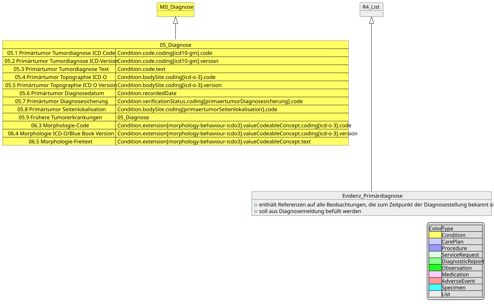
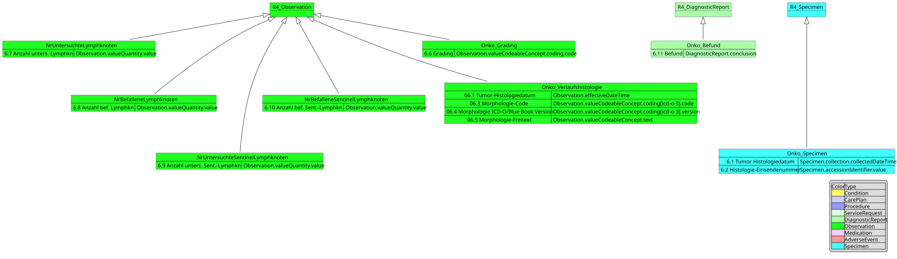
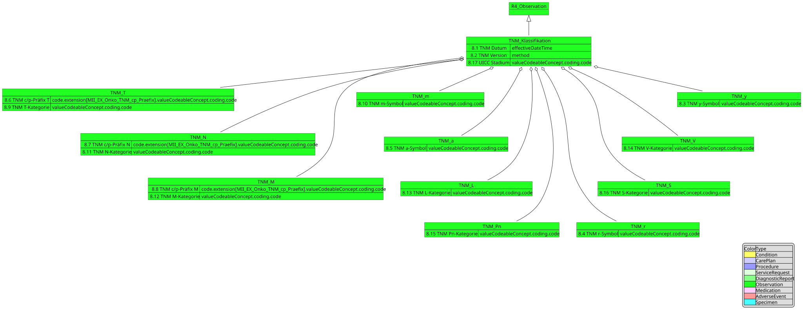
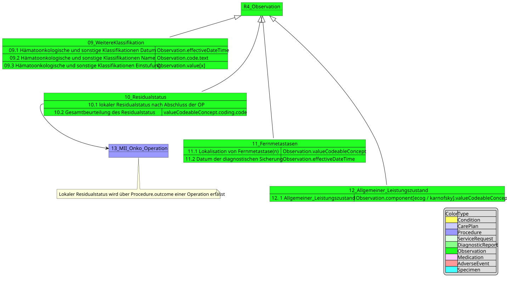
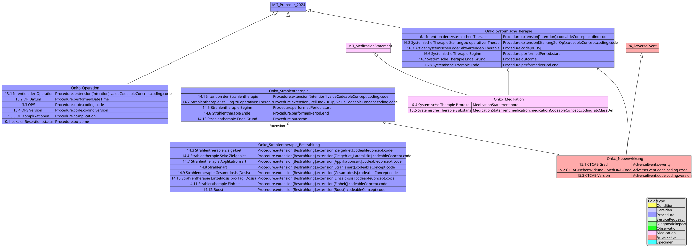
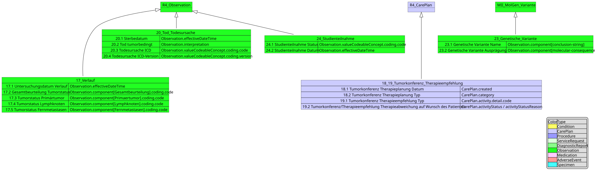

# Profile - Inhalt und Vererbung - MII IG Kerndatensatz-Modul Onkologie v2026.0.3

## Profile - Inhalt und Vererbung

Im Folgenden werden die Profile einmal in vereinfachter Version dargestellt. Diese Darstellung legt insbesondere Wert auf die übersichtliche Darstellung :

* Vererbung von anderen Profilen
* das Mapping der oBDS-Datenfelder auf die entsprechenden FHIR-Elemente.

Die Bildateien können [hier (Github)](https://github.com/medizininformatik-initiative/kerndatensatzmodul-onkologie/tree/refs/heads/dev/implementation-guides/ImplementationGuide-2026.x-DE/Images) zur besseren Darstellung einzeln betrachtet und heruntergeladen werden (Bereitstellung als `.png` und `.svg`).

### Diagnose

Die Diagnose enthält sowohl Informationen zur Primärdiagnose selbst, als auch zur Histologie und Lokalisation des Primärtumors.

-------

### Histologie

### TNM-Klassifikation

-------

### Weitere Klassifikationen, Residualstatus, Allgemeiner Gesundheitszustand, Fernmetastasen

-------

### Prozeduren, Medikation und Nebenwirkungen

-------

### Verlauf, Tumorkonferenz, Tod und Genetische Variante

