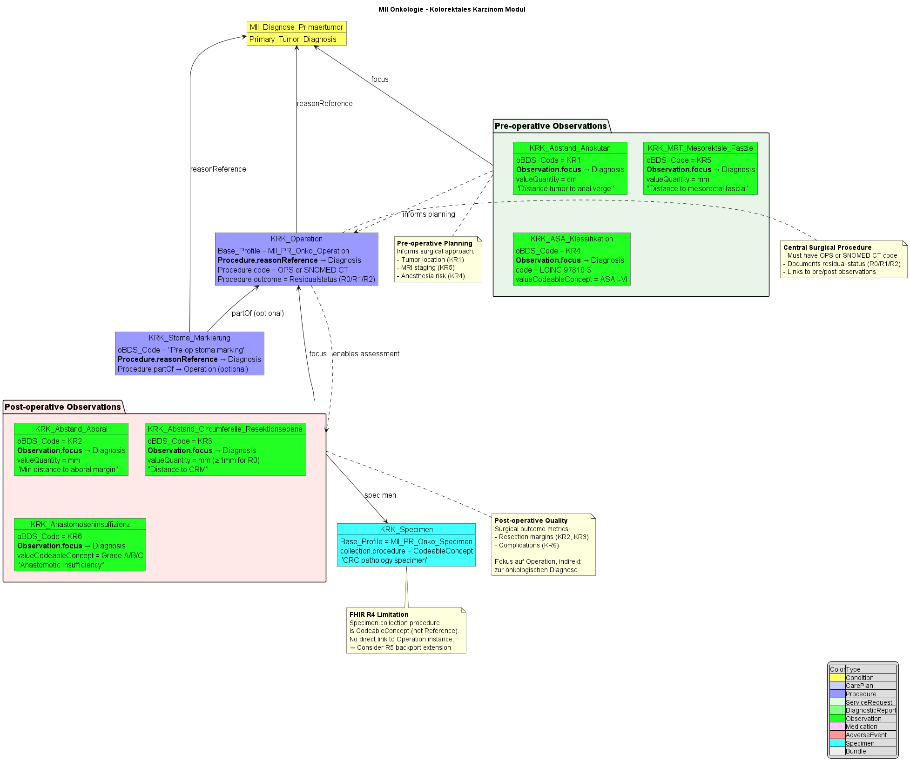

# Kolorektales Karzinom (KRK) - MII IG Kerndatensatz-Modul Onkologie v2026.0.3

## Kolorektales Karzinom (KRK)

 
There is no translation page available for the current page, so it has been rendered in the default language 

## Inhalt

Das **Kolorektales Karzinom (KRK) Modul** implementiert die organspezifischen FHIR-Profile für die Dokumentation von kolorektalem Karzinom gemäß dem onkologischen Basisdatensatz (oBDS).

Das Modul umfasst spezialisierte Profile für die charakteristischen Aspekte der KRK-Behandlung:

* **Präoperative Beurteilung**: Abstand zur Anokutanlinie, MRT-basierte Mesorektale Faszie-Messung, ASA-Klassifikation
* **Chirurgische Eingriffe**: KRK-spezifische Operationsverfahren und Stoma-Markierung
* **Resektionsränder**: Abstand zum aboralen Rand und zur zirkumferentiellen Resektionsebene (CRM)
* **Postoperative Komplikationen**: Anastomoseninsuffizienz-Graduierung
* **Pathologie-Specimens**: Spezifische Specimen-Profile für KRK-Resektate

## Architekturübersicht

Die folgende Abbildung zeigt die Struktur des KRK-Moduls und die Beziehungen zwischen den verschiedenen FHIR-Ressourcen:

## Verknüpfungen zu anderen Ressourcen

Die KRK-Profile sind eng mit den übergeordneten onkologischen Ressourcen verknüpft:

* **Primärtumor-Diagnose**: Alle KRK-spezifischen Observations referenzieren die Primärtumordiagnose als `focus`
* **Patient**: Direkte Verknüpfung über `subject`-Referenz
* **Encounter**: Optionale Verknüpfung zum behandelnden Aufenthalt
* **Procedure**: Integration der KRK-spezifischen Operationsverfahren
* **Specimen**: Pathologie-Specimens mit spezifischen KRK-Resektatdetails

## oBDS-Kontext

Die KRK-Profile implementieren folgende oBDS-Datenfelder:

* **KR1 Abstand Anokutanlinie**: Präoperative Lokalisation des Tumors
* **KR2 Abstand aboral**: Minimaler Abstand zum aboralen Resektionsrand
* **KR3 Abstand CRM**: Abstand zur zirkumferentiellen Resektionsebene
* **KR4 ASA-Klassifikation**: Anästhesierisiko-Bewertung
* **KR5 MRT Mesorektale Faszie**: Abstand zur mesorektalen Faszie im MRT
* **KR6 Anastomoseninsuffizienz**: Postoperative Komplikation (Grade A/B/C)

### Terminologie-Binding

Die KRK-Profile verwenden eine Kombination verschiedener Terminologien:

* **LOINC**: ASA-Klassifikation (97816-3)
* **SNOMED CT**: Medizinische Konzepte und Prozeduren
* **OPS**: Deutsche Operationscodes
* **oBDS-spezifische ValueSets**: Für Anastomoseninsuffizienz-Graduierung

## Enthaltene Profile

Das KRK-Modul umfasst folgende FHIR-Profile:

### Beobachtungen (Observations)

* **ASA-Klassifikation**: Präoperative Anästhesierisiko-Bewertung
* **Abstand Anokutanlinie**: Tumorlokalisation relativ zur Anokutanlinie
* **Abstand Circumferentielle Resektionsebene**: CRM-Messung
* **Abstand Resektionsrand Aboral**: Aboraler Sicherheitsabstand
* **MRT Mesorektale Faszie**: Präoperative MRT-Bewertung
* **Anastomoseninsuffizienz**: Postoperative Komplikation

### Verfahren (Procedures)

* **KRK-Operation**: Organspezifische chirurgische Eingriffe
* **Stoma-Markierung**: Präoperative Markierung für Stomaanlage

### Specimen

* **KRK-Specimen**: Pathologie-Specimen mit KRK-spezifischen Details

## Implementierungshinweise

### Datenerfassung

* **Zeitliche Zuordnung**: Präoperative vs. postoperative Beobachtungen
* **Referenzintegrität**: Konsistente Verknüpfung zu Primärtumordiagnose und Operation
* **Resektionsstatus**: R0/R1/R2-Klassifikation basierend auf Resektionsrändern

### Qualitätssicherung

* **Vollständigkeitsprüfung**: Kritische Datenfelder als Must Support markiert
* **Wertebereichsvalidierung**: Einschränkung auf medizinisch sinnvolle Wertebereiche
* **Terminologie-Konsistenz**: Verwendung standardisierter Kodierungssysteme

Die KRK-Profile ermöglichen eine vollständige und strukturierte Dokumentation der kolorektal-karzinom-spezifischen Daten entsprechend den aktuellen medizinischen Standards und dem oBDS.

## Beispiel

* [KRK-Bundle Beispiel](example-krk-bundle.md)

