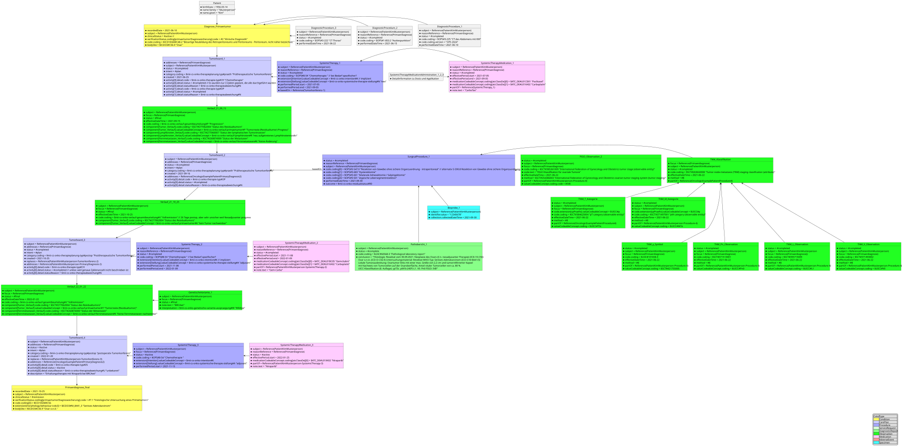

# Anwendungsfälle / Szenarien - MII IG Kerndatensatz-Modul Onkologie v2026.0.3

## Anwendungsfälle / Szenarien

### Anwendungsfälle / Szenarien

Der oBDS dient als Grundlage für die Krebsregistermeldungen an die Landeskrebsregister.

Die vorliegende Profilierung des oBDS hat den Anspruch, die Daten, die bei der Krebsregistrierung anfallen, für andere Forschungsfelder nutzbar zu machen.

So wird bei der FHIR-Abbildung des untenstehenden Beispiels klar, dass Informationen zu bildgebenden Verfahren, zu detaillierten Behandlungs- und Bestrahlungsschemata und zu genetischen Varianten außerhalb der Krebsregisterdaten in detaillierter Form vorliegen. Die vorliegende FHIR-Profilierung liefert damit einen wichtigen Beitrag zur Einbindung möglichst vieler Informationen für die onkologische Forschung.

### Anwendungsszenario einer leitliniengerechten Behandlung

> Disclaimer: Der Therapieverlauf entspricht einer möglichen leitliniengerechten Therapie; Daten und Verlauf sind für Testzwecke konstruiert, Ähnlichkeiten mit tatsächlichen Krankheitsverläufen sind zufällig.

#### Textuelle Darstellung des beispielhaften Therapieverlaufs

* Kim Musterperson, geb. 14.03.1956
* 10.06.2021 CT Abdomen mit KM: V. a. Peritonealkarzinose, Aszites im gesamten Bauchraum, Raumforderung Ovar rechts. Mesenteriale retroperitoneale LK-Metastasen, V. a. Lebermetastasierung
* 15.06.2021 Aszitespunktion: mit malignen Tumorzellen. Zytologisch mögliches Ovarial-CA.
* 22.06.2021 CT Thorax: kein Hinweis auf Metastasen.
* Tumorboard 25.06.2021: Eindeutiges CT-Korrelat und zytologisch ED Ovarial-CA. 
* Neoadjuvante Chemotherapie mit 3 Zyklen Carboplatin/Paclitaxel, Intervall-Debulking im Verlauf. 
* 05.07.21–25.07.21 Z1 Carboplatin AUC5 d1, Paclitaxel 175 mg/m² d1, Wdh. d21
* 26.07.21–15.08.21 Z2 Carboplatin AUC5 d1, Paclitaxel 175 mg/m² d1, Wdh. d21
* 16.08.21–05.09.21 Z3 Carboplatin AUC5 d1, Paclitaxel 175 mg/m² d1, Wdh. d21
 
 
* 15.09.21 CT Thorax/Abdomen: Peritonealkarzinose zunehmend, metastasensuspekte Lymphknoten retroperitoneal, V. a. konstante Lebermetastasierung.
* 16.09.21 Tumorboard: Deutlicher Tumorprogress. OP zur histologischen Sicherung bereits geplant, optimales Debulking anstreben.
* 30.09.2021 OP: Intervalldebulking mittels Längsschnittlaparotomie, Tumorresektion mittels Hysterektomie, bilateraler Adnexektomie und atypischer Lebersegmentresektion (Seg. II und V). Postoperativ: R0.
* Pathologischer Bericht 
* Histologie: Resektat vom 30.09.2021
* Neoplasie des Ovars (Z. n. neoadjuvanter Therapie) (ICD-10-C56), Ovar o. n. A. (ICD-O-C56.9), Untersuchungsmaterial: Resektat, WHO-Typ: Seröses Adenokarzinom (ICD-O M-8441/3)
* Lokale Tumorausbreitung: Ovartumor links mit einer max. Größe von 2,2 cm und tumorinfiltrierter Kapsel mit Nachweis von Tumorzellen auf der Ovaroberfläche, Anteil vitaler Tumorzellen von ca. 80 %.
* UICC-Klassifikation (8. Auflage): ypT3c, pM1b (HEP), L1, V0, Pn0; FIGO: IVB
* Immunhistochemie (Beispiel): Vereinzelt kräftige nukleäre Expression des Progesteronrezeptors. Positivität für P16 im Tumor. Proliferationsindex mittels MIB-1 max. 38 %. Mikroskopie: Partieller Nachweis von Muzin.
* Kommentar: Das immunhistochemische Markerprofil passt zu einem high-grade serösen Adenokarzinom des Ovars (Z. n. neoadjuvanter CTX).
 
* Tumorboard 25.10.2021: 
* Durch OP makroskopische Komplett-Resektion erreicht.
* Jedoch Progress unter Neoadjuvanz. Daher Umstellung auf Carboplatin/Gemcitabin.
* Humangenetische Vorstellung empfohlen.
 
* Systemische Therapie 
* 08.11.21–28.11.21 Z1 Carboplatin AUC 4 d1, Gemcitabin 1000 mg/m² d1+d8, Wdh. d22
* 29.11.21–19.12.21 Z2 Carboplatin AUC 4 d1, Gemcitabin 1000 mg/m² d1+d8, Wdh. d22
* 20.12.21–09.01.22 Z3 Carboplatin AUC 4 d1, Gemcitabin 1000 mg/m² d1+d8, Wdh. d22
 
* 15.01.22 CT Abdomen: Regredienz der bekannten Peritonealkarzinose; Leber ohne eindeutigen Hinweis auf Metastasierung (bei Z. n. atypischer Lebersegmentresektion a. e. narbige Veränderungen). Beurteilung: Regredienter Befund.
* 20.01.22 Tumorboard: Erhaltungstherapie mit Niraparib bei BRCAwt; Restaging in 3 Monaten mit CT Thorax/Abdomen und TM.
* 25.01.22 Beginn Niraparib 300 mg d1–28, Wdh. d28.

#### Grafische Darstellung des beispielhaften Therapieverlaufs

Die Bilddatei steht zur besseren Darstellung auch einzeln zur Verfügung (Bereitstellung als `.svg`).

